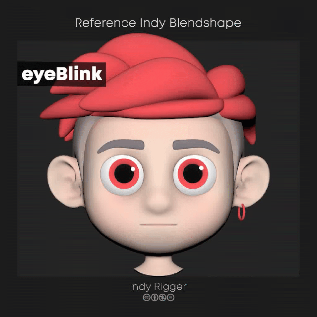
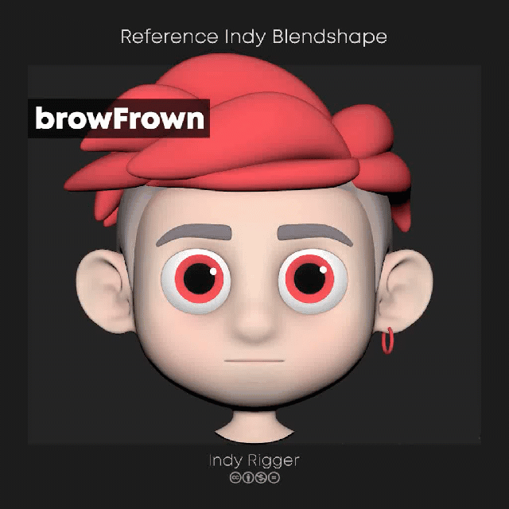
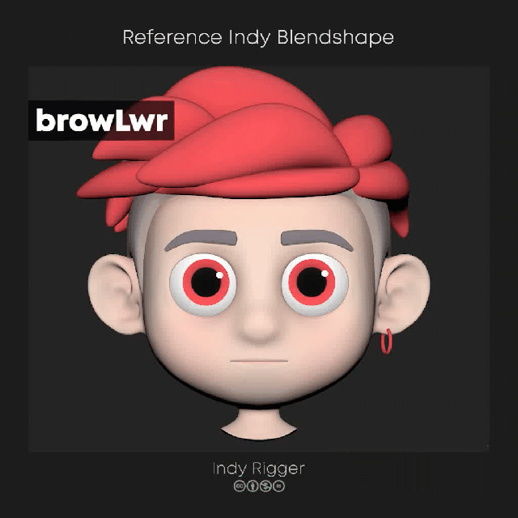
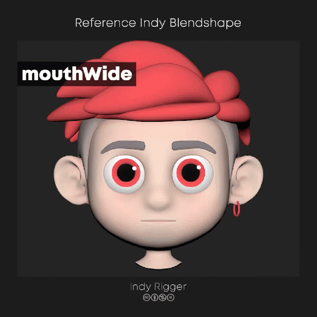
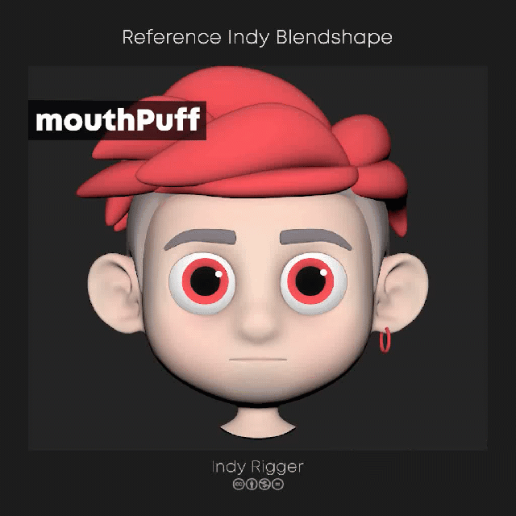
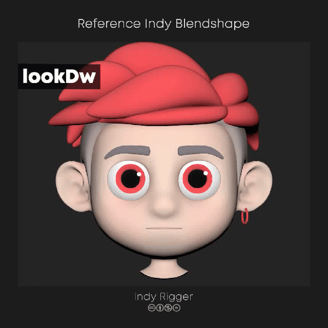

# Facial Blendshape Reference 
     

**Facial Blendshape Reference** is a set of 15 essential targets for facial rigging, covering key movements of brows, eyes, and mouth. It provides a clean, consistent foundation for building production-ready rigs and expanding into more complex expressions.

## **1. eyeBlink** 

  

### Eye closing (Blink)

- Upper eyelid moves down ~80–90%
- Lower eyelid moves up ~10–20%
- Lower eyelid pushes upward slightly
- Brows lower slightly

> 💡 This facial expression should be split into left / right for independent, precise asymmetrical control
> 

---

## **2. eyeOpen**

  

### Wide open eyes

- Upper eyelid raises ~10–20% from neutral
- Lower eyelid lowers slightly
- Brows lift slightly (~5–10%)

> 💡 This facial expression should be split into left / right for independent, precise asymmetrical control
> 

---

## **3. eyeBrowSad**

  

### Sad brows

- Inner brows raise ~15–25%
- Forehead forms angled wrinkles (Advanced)

> 💡 This facial expression should be split into left / right for independent, precise asymmetrical control
> 

---

## **4. eyeBrowFrown**

  

## Frown (angry / stressed)

- Inner brows move downward ~15–25%
- Vertical wrinkles appear between the brows (Advanced)

> 💡 This facial expression should be split into left / right for independent, precise asymmetrical control
> 

---

## **5. eyeBrowLower**

  

### Lowered brows (Neutral → Serious)

- Entire brow line moves down ~15–25%
- No inward compression (unlike frown)
- Upper eyelids are slightly pushed down

> 💡 This facial expression should be split into left / right for independent, precise asymmetrical control
> 

---

## **6. eyeBrowUpper**

  

### Raised brows

- Entire brow line lifts ~15–25%
- Forehead stretches upward
- Upper eyelids open slightly more

> 💡 This facial expression should be split into left / right for independent, precise asymmetrical control
> 

---

## **7. mouthNarrow**

  

### Narrow / Pucker

- Mouth corners pull inward
- Lips push slightly forward
- Upper and lower lips compress together
- Cheeks pull inward slightly

> 💡 This facial expression should be split into left / right for independent, precise asymmetrical control
> 

---

## **8. mouthWide**

  

### Wide / Spread

- Mouth corners pull outward ~20–30%
- Lips stretch and become thinner
- Cheeks stretch outward

> 💡 This facial expression should be split into left / right for independent, precise asymmetrical control
> 

---

## **9. mouthSmile**

  

### Smile

- Mouth corners lift ~20–40%
- Cheeks raise (cheek lift)
- Lower eyelids lift slightly (smile eyes)
- Nasolabial fold becomes more defined (Advanced)

> 💡 This facial expression should be split into left / right for independent, precise asymmetrical control
> 

---

## **10. mouthSad**

  

### Sad mouth

- Mouth corners pull downward ~15–25%
- Lower lip pushes slightly forward
- Chin tightens (mentalis activation)
- Cheeks drop slightly

> 💡 This facial expression should be split into left / right for independent, precise asymmetrical control
> 

---

## **11. mouthSneer**

  

### Sneer

- One side of the mouth corner lifts
- The other side stays neutral or slightly lowers
- Upper lip on the lifted side raises (teeth visible)
- Nose wrinkles slightly on that side

> 💡 This facial expression should be split into left / right for independent, precise asymmetrical control
> 

---

## **12. mouthPuff**

  

### Puffed cheeks

- Cheeks expand outward
- Internal cheek volume increases

> 💡 This facial expression should be split into left / right for independent, precise asymmetrical control
> 

---

## **13. lookUp**

  

### Looking up (focus on brows)

- Brows raise ~5–10%
- Upper eyelids open slightly more
- Lower eyelids follow slightly (~5–10%)

> 💡 This facial expression does not need to be split into left / right. 
💡 Eye models typically do not require blendshapes, as they are usually driven by joints (skinning) instead.
> 

---

## **14. lookDown**

  

### Looking down (focus on brows)

- Brows lower ~5–10%
- Upper eyelids lower ~10–20%
- Lower eyelids raise slightly

> 💡 This facial expression does not need to be split into left / right. 
💡 Eye models typically do not require blendshapes, as they are usually driven by joints (skinning) instead.
> 

---

## **15. lookSide**

  

## Looking left (focus on brows)

- Left brow raises while right brow stays neutral
- Left eyelid opens slightly wider, right eyelid closes slightly
- For looking right, reverse the behavior

> 💡 This facial expression does not need to be split into left / right. 
💡 Eye models typically do not require blendshapes, as they are usually driven by joints (skinning) instead.
> 

---

## ⚠️ Percentage values are **guidelines**, not absolute values

---

 

## Get the Tools
Visit the official store for advanced scripts and premium rigging assets.

 

## Support This Project
If you find these tools helpful, consider supporting further development.

 

## Connect & Contact
Follow for the latest updates, tutorials, and more rigging content.

  

 
 

🔴 เครื่องมือตัวนี้ผมตั้งใจทำและปล่อยให้ โหลดไปใช้กันได้ฟรีๆ ครับ เพราะอยากซัพพอร์ตน้องๆ นักเรียน หรือ Rigger มือใหม่ที่กำลังเริ่มหัดริก แต่อาจจะยังไม่มีงบซื้อเครื่องมือแพงๆ ผมอยากให้ทุกคนมีของดีไว้ใช้ฝึกฝนและอัปสกิลตัวเองกันให้เต็มที่

หวังว่า IDR Tools จะช่วยให้เส้นทางสาย Rigger ของทุกคนไปได้ไกลขึ้นนะครับ... วันไหนที่เก่งแล้ว ประสบความสำเร็จแล้ว จะกลับมาช่วยพัฒนา หรือสนับสนุนโปรเจกต์นี้ในรูปแบบไหน ผมก็ยินดีและขอบคุณมากๆ ครับ

…

🔴 I created this tool and made it freely available for download because I want to support students and beginner riggers who are just starting out but may not have the budget for expensive tools. I hope everyone can have access to good resources to practice and fully develop their skills.

I truly hope that IDR Tools can help you go further on your journey as a rigger. And one day, when you've grown and found success, if you choose to come back and contribute to the development or support this project in any way, I would deeply appreciate it.

 

© 2026 Indy Rigger • Some rights reserved.

