# IDR BlendshapeControl v2026.1
    [](https://creativecommons.org/licenses/by-nc/4.0/) 

<br>

<p align="center">
  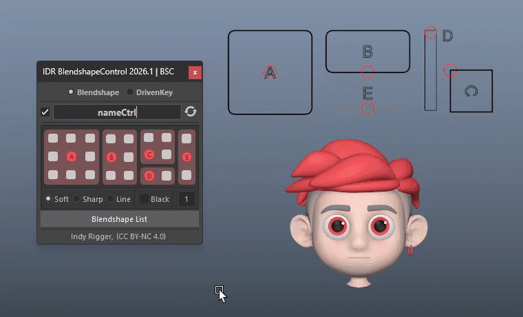
</p>

A powerful toolkit for building and managing blendshape-based facial rigs in Maya without manual node connections. Since facial rigging can be set up in many ways, and one common approach is using blendshapes as a foundation, this tool is designed to generate controllers that efficiently drive blendshapes. It supports multiple controller types (Type A–E), enabling a faster and more reliable workflow.

<br>

- **5 Ctrl Types (A–E)** — Prebuilt NURBS controls with limits and zone buttons per direction
- **3 Visual Styles** — Shape, Soft, Line (set on creation)
- **Blendshape Mode** — Link zones to blendshape weights with auto node setup
- **Driven Key Mode** — Drive any transform channel on any node
- **🔴 Red Button** — Create Controller
- **⚪ White Button** — No Connection
- **🟡 Yellow Button** — Connected

---

# Install Tools
👉 **[Installation Guide](./Install-Tools.md)**
<br>
<br>


# Quick Walkthrough

## Blendshape Mode

1. Add blendshapes to the base mesh
2. Open the tool and switch to **Blendshape Mode**
3. Enter a name
4. Select the desired frame style
5. Choose a Controller Type and click the red button
6. Open **Blendshape List**
7. Select the desired blendshape and target
8. Click a white zone button to connect
9. When connected, the white button turns yellow, and the Blendshape List UI is highlighted in red

<p align="center">
  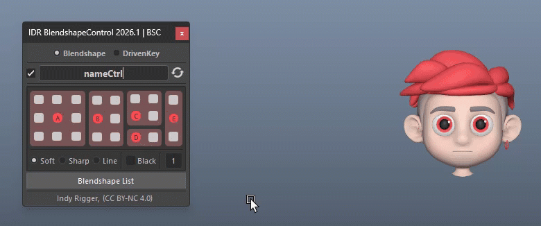
</p>

<br>

## Driven Key Mode

1. Open the tool and switch to **DrivenKey Mode**
2. Enter a name
3. Select the desired frame style
4. Choose a Controller Type and click the red button
5. Adjust the object to the desired position
6. Select the desired channel(s) in the Channel Box
7. Click a white zone button to connect
8. Once connected, the button turns yellow

<p align="center">
  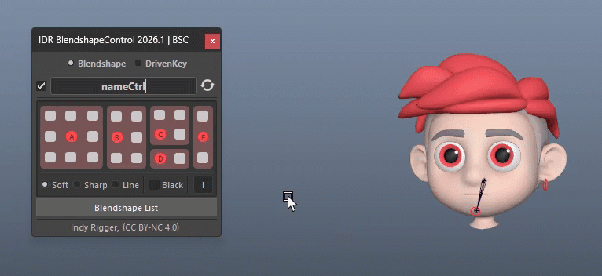
</p>

> <small>💡 This tool is designed for fast workflow, but you can manually set up Set Driven Keys with the controller when needed.</small>

<br>

## Combined Usage

You can combine modes — for example, starting with Driven Key Mode and then switching to Blendshape Mode, or using them in any order as needed.

<p align="center">
  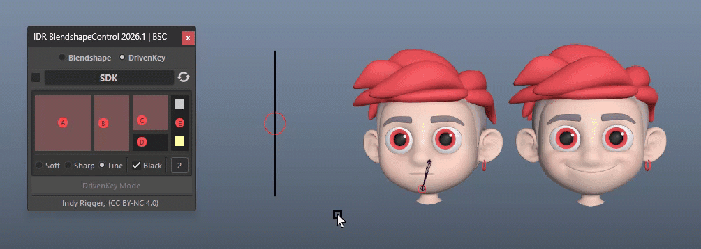
</p>

<br>

## Break Connection

Right-click the yellow button or the red highlight, then choose **Break Connection**.

<p align="center">
  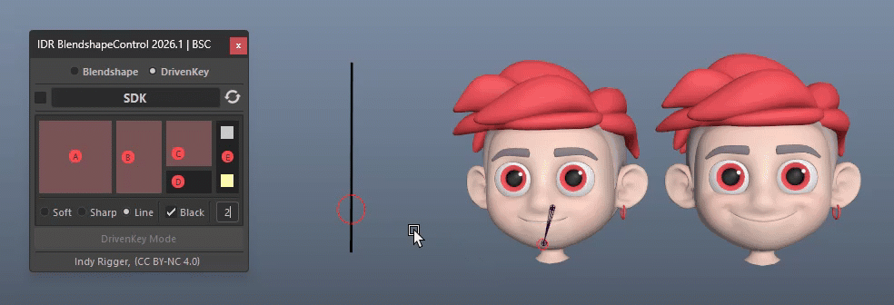
</p>

<br>
<br>

# UI Walkthrough

## Mode Selection

Located at the very top of the window. Two radio buttons select the global operating mode:

- **Blendshape Mode** — connects zones to blendShape weight attributes (Default)
- **Driven Key Mode** — connects zones to transform channels on any scene node; requires selected attributes in the Channel Box

<p align="center">
  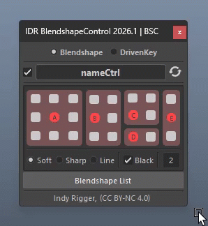
</p>

> <small>💡 Switching mode does not affect existing connections. Each mode operates independently on its own node graph.</small>

<br>

## Name Field and Show Name

Type a name to set the base name for the controller to be created.

| Option | Behavior |
| :--- | :--- |
| **Checked** | Creates a text-curve label (ctrl name) inside the controller in the viewport |
| **Unchecked** | Label not displayed; input name remains visible in the Outliner |

<p align="center">
  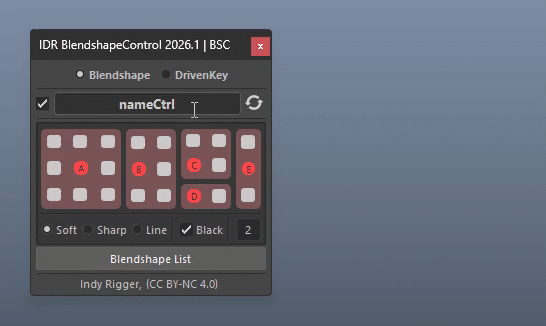
</p>

> <small>💡 **Reset** — Right-click to restore the default (nameCtrl).</small>

<br>

## Create Controller

Enter a name, then click the red circle button (A–E) to create the controller.

<p align="center">
  
</p>

> <small>💡 To adjust its position, select the text-curve in the Outliner and move it as needed.</small>

<br>

## Style Controller

<p align="center">
  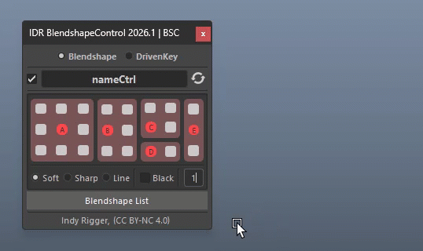
</p>

**3 Frame Styles** — Choose from 3 exclusive options to control the Frame Curve visual style.

| Style | Description |
| :--- | :--- |
| **Shape** | Sharp corners |
| **Soft** | Rounded corners (default) |
| **Line** | Outline (A/B/C) or simple line (D/E), with thicker line |

<br>

**2 Frame Colors** — Controls the frame's display type to prevent selection in the viewport.

| Option | Behavior |
| :--- | :--- |
| **Checked** | Black (Reference mode) |
| **Unchecked** | Grey (Template mode, default) |

<br>

**Frame Thickness** — Adjust the curve thickness (Min/Default = 1).

> <small>💡 **Middle-Drag** left/right over the field to quickly change values.</small>

<br>

## Reload

Updates the tool to the selected controller type. Select a ctrl and press **Reload** (e.g. after reopening the tool, or when switching between types). Also refreshes all zone button colors to match current connection states.

<p align="center">
  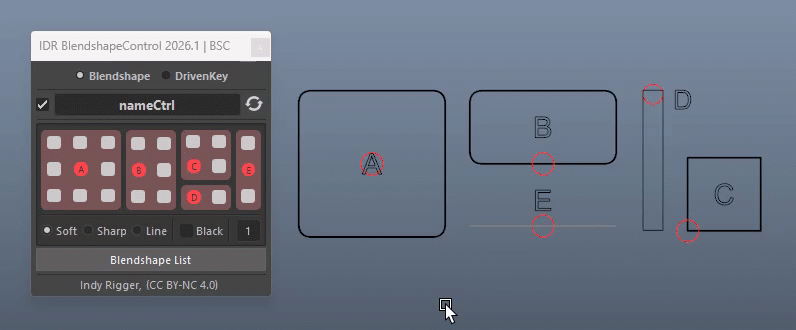
</p>

<br>
<br>

## Break Connection

### Blendshape Mode

**From a zone button**

1. Right-click a yellow (connected) zone button
2. Select **Break Connection** to disconnect only that zone, or **Break Connection All** to disconnect all zones on the current ctrl at once
3. The zone button returns to white
4. The blendshape weight is reset to 0
5. All related utility nodes are removed from the scene

<p align="center">
  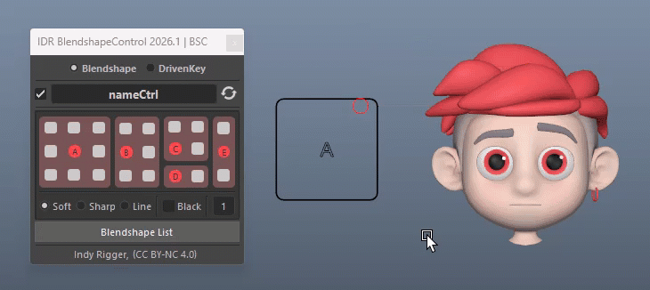
</p>

<br>

**From the Blendshape List**

1. Right-click a red-highlighted weight in Blendshape List
2. Select **Break Connection**
3. The tool reverse-looks up which ctrl and zone are driving that weight
4. Breaks the connection, resets the weight to 0, and refreshes colors in both panels

<p align="center">
  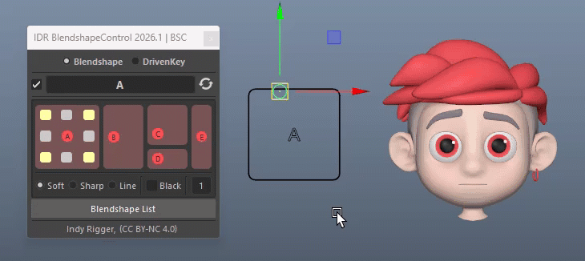
</p>

<br>

### Driven Key Mode

1. Switch to **Driven Key Mode**
2. Ensure the correct ctrl name is in the name field
3. Right-click a yellow (connected) zone button
4. Select **Break Connection** to disconnect only that zone
5. The zone button returns to white
6. The DRN_GRP transfers its values back to the node and deletes itself

<p align="center">
  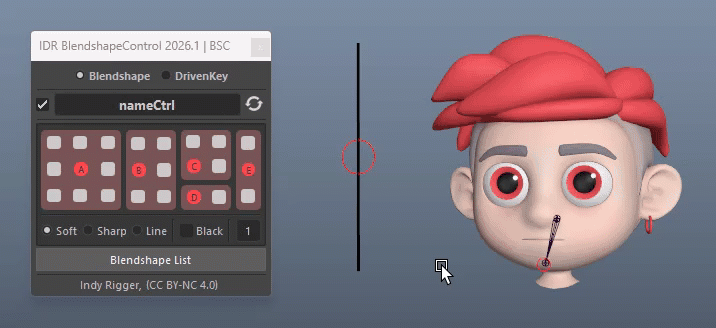
</p>

<br>
<br>

## Blendshape List Window

A separate panel on the right of the main window, containing two list widgets divided by a resizable splitter.

### List A — BlendShape Nodes

<p align="center">
  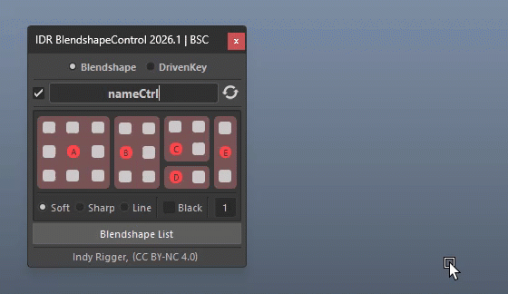
</p>

Displays all blendShape nodes in the scene (loaded on open or via Reload).

| Action | Behavior |
| :--- | :--- |
| **Click a node** | List B shows its weight targets (populated from the first selected node) |
| **Ctrl+Click / Shift+Click** | Multi-selection |
| **RMB → Clear Selected** | Remove selected nodes from the list (UI only; does not affect the scene) |
| **RMB → Select Node** | Select the blendshape node in the scene (single selection only) |
| **RMB → Shape Editor** | Open Maya Shape Editor |

<br>
<br>

### List B — Weight Targets

<p align="center">
  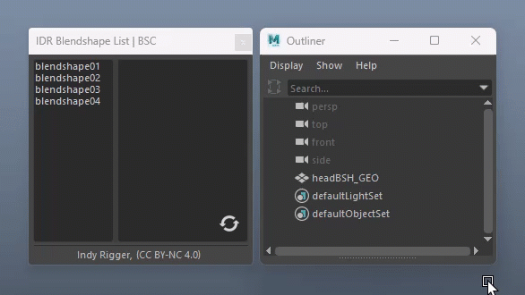
</p>

Displays weight targets of the selected blendShape node.

| Action | Behavior |
| :--- | :--- |
| **Red background** | Weight is already connected to a ctrl zone |
| **Click** | Select to connect zones from the main window |
| **Middle-mouse drag** | Reorder items; order is saved per blendShape node and restored on next open |
| **RMB → Break Connection** | Disconnect, reset weight to 0, and refresh colors |
| **RMB → Select Mesh** | Select the target mesh in the scene |
| **RMB → Rebuild Target** | Restore a missing target mesh (if deleted or only weight exists) |
| **RMB → Rebuild Target All** | Restore all target meshes from List B |
| **Reload** | Repopulates List A from the scene and auto-populates List B from the first node |

<br>
<br>

# Controller Type and Zone Map

> <small>💡 These examples are flexible guidelines, not fixed rules, and can be adapted to suit your rig and workflow.</small>

<br>

## Type A — Full Range (8 Zones)

Use when movement occurs in all directions: up, down, left, right, and diagonals.

```
NW  │  N  │  NE
────┼─────┼────
 W  │  ·  │  E
────┼─────┼────
SW  │  S  │  SE
```

<br>
<br>

**Mouth Corner Example**

<p align="center">
  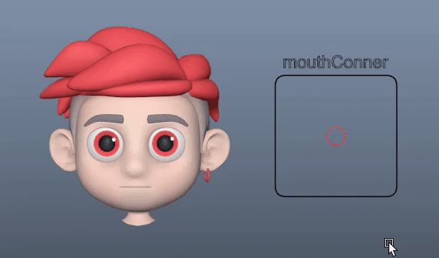
</p>

| Zone | Example Blendshape |
| :--- | :--- |
| NW | Smile Left |
| NE | Smile Right |
| N | Smile Both |
| SW | Frown Left |
| SE | Frown Right |
| S | Frown Both |
| W | Wide Left |
| E | Wide Right |

<p align="left">
  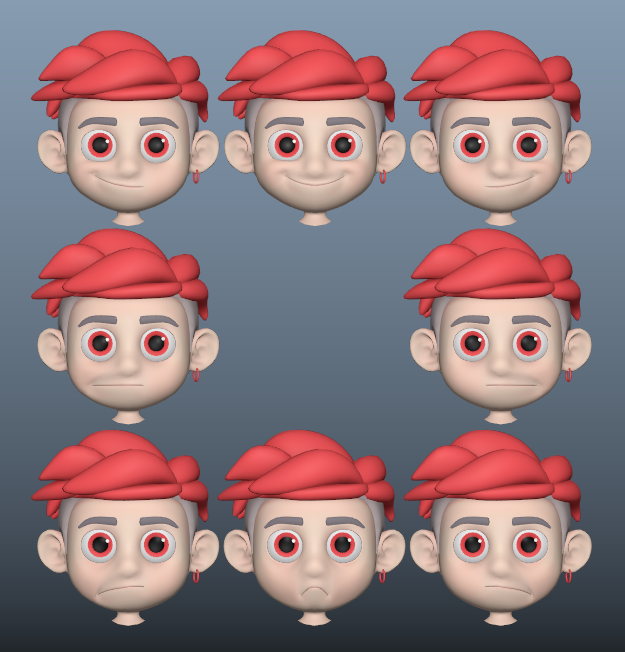
</p>

<br>
<br>

**Cheek Puff / Suck Example**

<p align="center">
  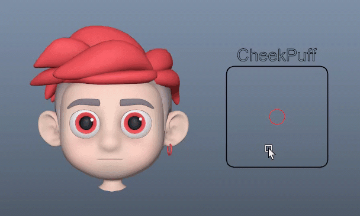
</p>

| Zone | Example Blendshape |
| :--- | :--- |
| NW | Cheek Puff Left |
| NE | Cheek Puff Right |
| SW | Cheek Suck Left |
| SE | Cheek Suck Right |
<p align="left">
  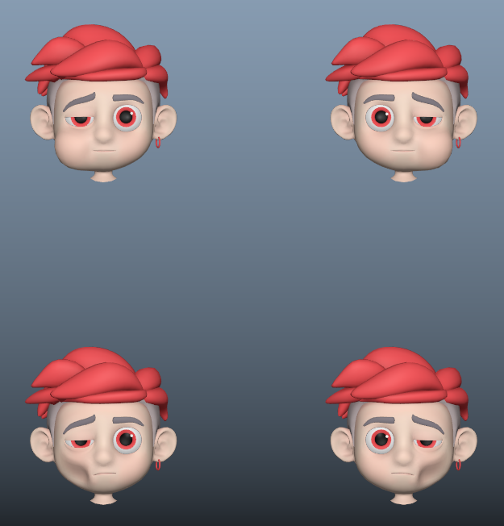
</p>
<br>
<br>

## Type B — Upper Half (5 Zones)

Use when movement is limited to the upper area: NW, N, NE, W, E.

```
NW  │  N  │  NE
────┼─────┼────
 W  │  ·  │  E
```

> <small>💡 **Scale the group to -1 (Y)** to flip the position if needed.</small>

<br>
<br>

**Eye Blink Example**

<p align="center">
  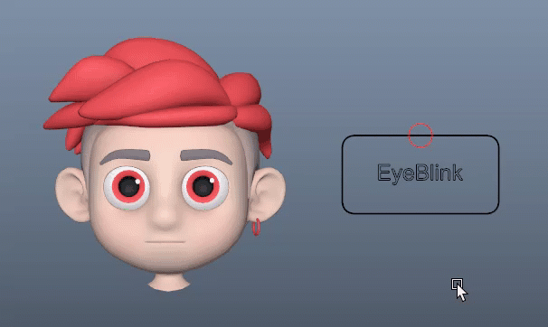
</p>

| Zone | Example Blendshape |
| :--- | :--- |
| NW | Blink Left |
| NE | Blink Right |
| N | Blink Both |
| W | Half Blink Left |
| E | Half Blink Right |
<p align="left">
  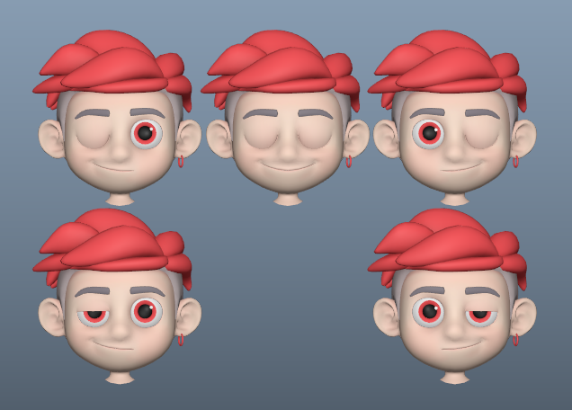
</p>
<br>
<br>

## Type C — Upper-Right Quadrant (3 Zones)

Use when movement is confined to the upper-right area.

```
    │  N  │  NE
────┼─────┼────
    │  ·  │  E
```

> <small>💡 **Scale the group to -1 (X, Y)** to flip the position if needed.</small>

**Eyebrow Move Example**

<p align="center">
  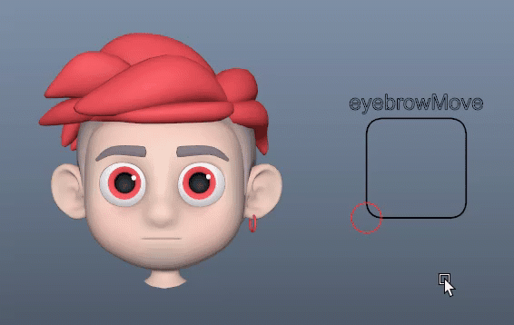
</p>

| Zone | Example Blendshape |
| :--- | :--- |
| NE | Eyebrow Raise |
| N | Eyebrow Furrow |
| E | Eyebrow Lower |
<p align="left">
  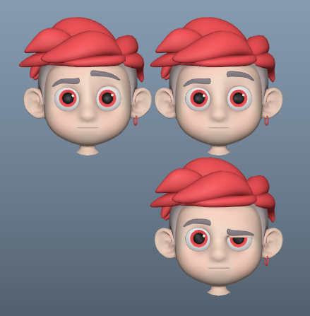
</p>
<br>
<br>

## Type D — Single Axis Upward (1 Zone)

Use when movement is upward only.

```
    │  N  │
────┼─────┼────
    │  ·  │
```

**Jaw Open Example**

<p align="center">
  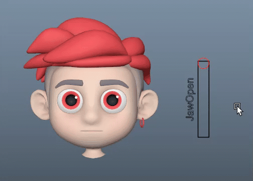
</p>

| Zone | Example Blendshape |
| :--- | :--- |
| N | Jaw Open |
<p align="left">
  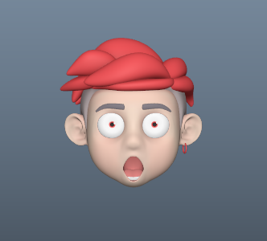
</p>
<br>
<br>

## Type E — Single Axis Up / Down (2 Zones)

Use when movement is up and down.

```
    │  N  │
────┼─────┼────
    │  ·  │
────┼─────┼────
    │  S  │
```

**Brow Center Example**

<p align="center">
  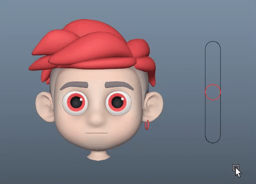
</p>

| Zone | Example Blendshape |
| :--- | :--- |
| N | Brow Center Raise |
| S | Brow Center Press |
<p align="left">
  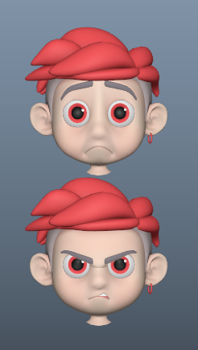
</p>
<br>
<br>

---

# **🔴 Troubleshooting**

- **Zone stays white** — Node/weight not selected or ctrl empty → Select List A + B, retry
- **Zone already connected** — Already connected → **Break Connection** first
- **Weight already in use** — Weight in use → Break in List B, then reconnect
- **Ctrl name not updating** — Auto-reload → Press **Reload** if needed
- **Corner incorrect** — T/B switches mode → Break T/B to reset
- **Node has suffix** — Old connection not broken → Break, then reconnect
- **DRN_GRP remains** — Driven Key still exists → Break all
- **Rebuild disabled** — Mesh already exists → Use **Select Mesh**
- **List A empty** — No blendShape in scene → Create one, then Reload

<br>

# **🔴 Terminology**

- **_GRP** — Top ctrl group; stores type and connectionMode
- **_FRM** — Outer NURBS frame (reference/template)
- **_CTL** — Main control (reads tx/ty)
- **_TXT** — Label curves (no rig logic)
- **Zone** — Uses compass directions (N, S, E, W, NE/NW/SE/SW) or TL, T, TR, L, R, BL, B, BR (independent links)
- **_DRV (zone)** — setRange (0–1) zone driver
- **_DRN (attr)** — Per-attribute setRange mapping
- **_DRN_GRP** — Offset group for driven node
- **BSH / blendShape** — Deformer node
- **Stored target** — No live mesh (baked)
- **Live mesh** — Connected geometry

<br>
<br>

## Get the Tools
Visit the official store for advanced scripts and premium rigging assets.

[](https://indyrigger.gumroad.com/)

<br>

## Support This Project
If you find these tools helpful, consider supporting further development.

[](https://buymeacoffee.com/indyrigger)

<br>

## Connect & Contact
Follow for the latest updates, tutorials, and more rigging content.

[](https://www.facebook.com/indyrigger) [](https://www.youtube.com/indyrigger) [](mailto:rigger.indy@gmail.com)

<br>
<br>

<p align="center">
© 2026 Indy Rigger • Some rights reserved.
</p>