# IDR ControllerTools v2026.1
    [](https://creativecommons.org/licenses/by-nc/4.0/) 
<br>

<p align="center">
  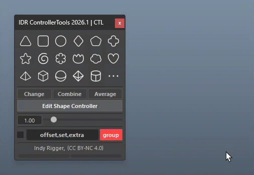
</p>

A powerful toolkit for creating, editing, and managing rigging controllers (NURBS curves) in Autodesk Maya. Designed to streamline repetitive tasks and speed up your rigging workflow, this tool lets you perform complex operations with just a few clicks.

<br>

# Install Tools
👉 **[Installation Guide](../Install-Tools.md)**

<br>
<br>


## Suffix Settings

💡 Before starting, configure the Curve and Shape suffixes to match your pipeline naming. This helps ensure all created nodes follow a consistent standard and integrate smoothly with your team’s workflow.

<p align="center">
  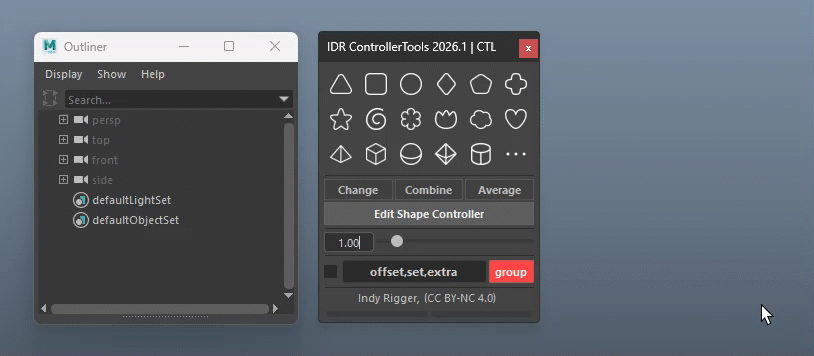
</p>

Examples of custom pipeline configurations:

| Curve | Shape | Result |
| --- | --- | --- |
| CTRL | Shape | Cube_**CTRL** / Cube_CTRL_**Shape** |
| con | con | Cube_**con** / Cube_con_**con** |
| CTL | SHP | Cube_**CTL** / Cube_CTL_**SHP** |

> <small>💡 Auto Save — Suffix settings are saved on close and restored on next launch. No need to reconfigure each session.</small>

<br>
<br>


## 69 Preset Controller

<p align="center">
  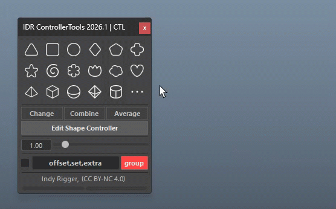
</p>


Create NURBS controllers from 69 preset shapes—just click an icon.

- **Left-click**: Creates the controller in the default orientation.
- **Right-click**: Rotate 90° (X / Y / Z)

<br>

## Your Controller

<p align="center">
  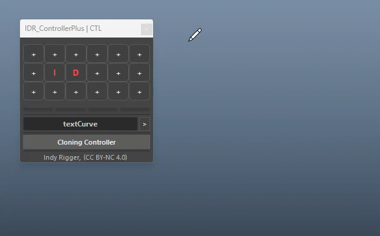
</p>

Save custom shapes to 18 slots for quick reuse.

- **Save**: Create → Select → Click (+) → Name
    
    > <small>⚠️ Single-shape only</small>

- **Create**: Click slot (uses Suffix Settings)
- **Manage**: Right-click → Rename / Remove / Remove All
- **Auto Save**: Saved & restored automatically
File: `resources/presets/your_controllers.json`
    
    > <small>💡 Share the JSON for team use </small>

<br>

## Text Curve

<p align="center">
  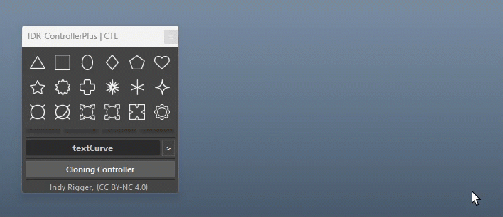
</p>

Create NURBS curves from text (useful for labels/controllers).

- Type text → choose font (right-click) → create

> <small>⚠️ Unsupported fonts reset to default with a warning.<br>
> 💡 Font auto-saves; shape names follow suffix </small>
> 

<br>

## Cloning Controller

<p align="center">
  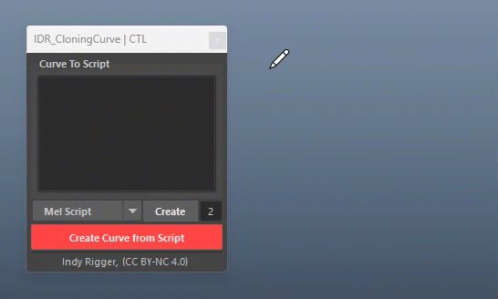
</p>

Convert NURBS curves to MEL/Python code with adjustable precision.

- **Curve to Script**: Extract from selected curve (set language & precision)
- **Create From Code**: Paste code to recreate

> <small>💡 Higher precision = more accurate; lower = shorter code</small>

<br>

## Cloning Controller and Your Controller

**Cloning Controller** reuses shapes like Your Controller, but exports them as code for flexible storage, scripting, or sharing.

<br>
<br>

## Group Object

<p align="center">
  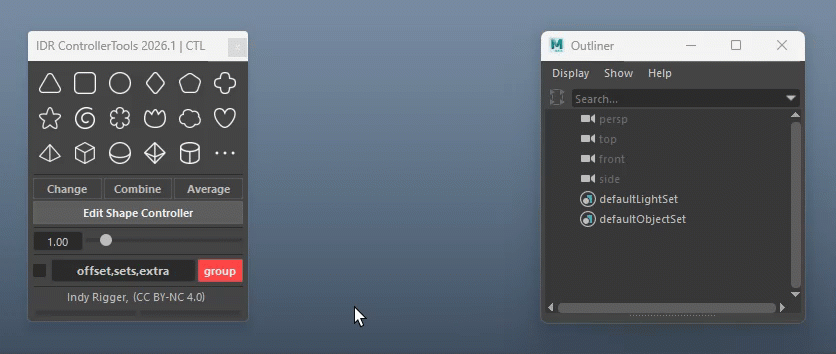
</p>


Creates nested offset groups above the selected object.

- **Auto**: Adds groups on controller creation
- **Manual**: Click **Group** to add on selected
- **Group Names**: Use comma-separated suffixes (e.g., offset,sets,extra) to define layers/order
- **Right-click** to reset to default

**Example:** `offset,sets,extra1,extra2,extra3` 
Creates nested groups (outer → inner):

```text
Cube_offset
└── Cube_sets
    └── Cube_extra1
        └── Cube_extra2
            └── Cube_extra3
                └── Cube_CTL
```

<br>
<br>


## Edit with Indy Locator

Adds a red locator to edit controller CVs by dragging (supports multi-shape).

> <small>⚠️ Use **Delete "editCTL_GRP"** to finish—don’t delete it manually.<br>
> 💡 Button auto-activates when detected.</small>
> 

<p align="center">
  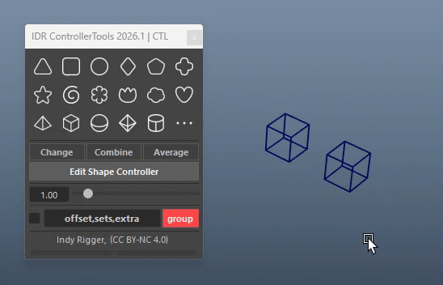
</p>

<br>

## Scale Shape

Scale CVs without affecting transforms. Enter value or middle-drag (min: 1.0).

<p align="center">
  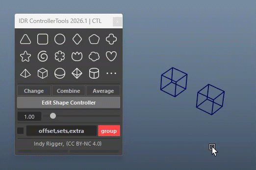
</p>

<br>

## Select CV

Select all CVs in one click for easy editing.

<p align="center">
  
</p>

<br>

## Change Shape

Replace a controller’s shape using another (select source → target last).

> <small>💡 Commonly used for controllers with existing connections.</small>

<p align="center">
  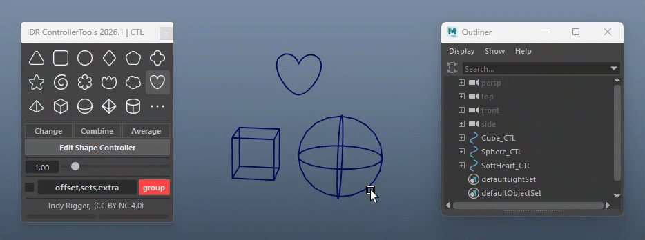
</p>

<br>

## Combine / Uncombine Curves

Merge or split curves (parenting shapes). CVs keep world positions; shapes follow the same suffix naming.

<p align="center">
  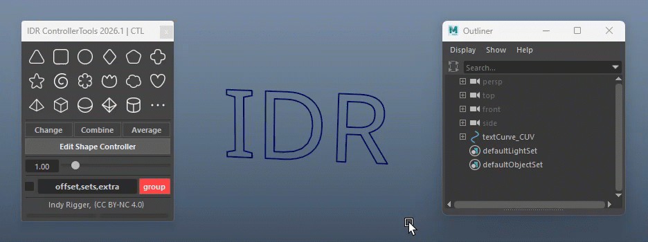
</p>

<br>

## Curve Width

Adjust curve thickness via slider or input. 
Middle-drag to scrub, Ctrl+drag for fine control, right-click to reset.

<p align="center">
  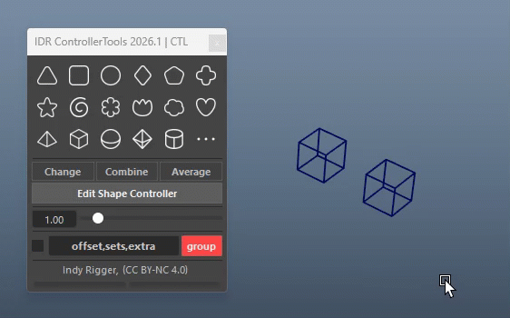
</p>

<br>

## Average Distribute

Evenly distributes attributes between the first and last selected objects (supports Translate / Rotate / Scale per axis or XYZ).

<p align="center">
  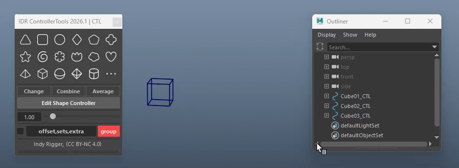
</p>

<br>

---

# 🔴 Troubleshooting

- **Shelf Button not working**: Ensure the folder is in the correct path and named properly. Restart Maya and recreate the shelf if needed.
- **Font issues**: Only system-supported fonts work in Maya. Unsupported fonts fallback to default (Arial) with a warning. Use fonts with full glyph support (e.g., Thai fonts).
- **Missing icons**: Check `resources/icons/` path and ensure all icons are `.png` with correct naming. New icons load on next launch.
- **Controller not visible**: Enable *Show > NURBS Curves* in the viewport.
- **UI freeze/unresponsive**: Run `IDR_ControllerTools.show()` again to reset the UI.

<br>

# 🔴 Terminology

- **Offset Group**: Parent group used to zero transforms for easy reset.
- **CV (Control Vertex)**: Points that define the curve shape.
- **Suffix**: Naming convention tag (e.g., _CTL, _SHP, _GRP).
- **Shape Node**: Stores actual curve data under a transform.
- **Freeze Transform**: Reset TRS to default without moving the object.
- **World Space**: Global coordinate system used for consistent positioning.

<br>

## Get the Tools
Visit the official store for advanced scripts and premium rigging assets.

[](https://indyrigger.gumroad.com/)

<br>

## Support This Project
If you find these tools helpful, consider supporting further development.

[](https://buymeacoffee.com/indyrigger)

<br>

## Connect & Contact
Follow for the latest updates, tutorials, and more rigging content.

[](https://www.facebook.com/indyrigger) [](https://www.youtube.com/indyrigger) [](mailto:rigger.indy@gmail.com)

<br>
<br>

<p align="center">
© 2026 Indy Rigger • Some rights reserved.
</p>