# IDR CustomColor v2026.1
     

 

  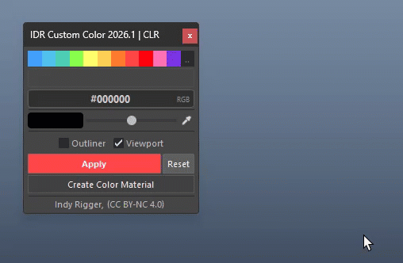

A powerful toolkit for fast, consistent coloring in Maya. Includes 115 preset colors (Index & ACES) with accurate viewport matching, plus HEX/RGB/HSV/ACEScg input and Eyedropper. Random, Rainbow, Fade, Blend, and 12 Favorites enable quick multi-object coloring.

 

## Installation Guide

👉 **[Install Tools](../Install-Tools.md)**

 

## Color System & ACES**

💡 Before starting, the tool includes 115 preset colors: 31 Maya Index Colors and 84 ACES colors. This ensures accurate viewport color matching across all modes.

  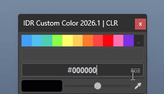

## What is ACES?

The ACES values in this tool are not true ACEScg. They are sampled directly from Maya to ensure a 100% match with viewport colors. This can be considered "Fake ACES," focused on visual accuracy.

The tool provides three color modes: **Index**, **ACES**, and **RGB**.

> <small>⚠️ Custom colors (Eyedropper or HEX) use standard RGB only and may not match exactly in the viewport. 
> 💡 For more details on RGB, Maya Index Color, and ACEScg, see the Terminology section below.</small>

 
 

## 115 Preset Colors

  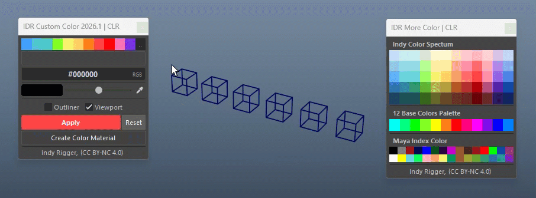

Browse and apply from 115 preset colors divided into:

- **Main Palette** (11 signature colors)
- **More Colors** (104 extended colors)

 
 

## Color Input

  

Enter the desired color value in HEX / RGB / HSV / ACEScg format.

- **Right-click** input field to switch color mode
- **Smart paste**: auto-detects format on paste

 
 

## Current Color

  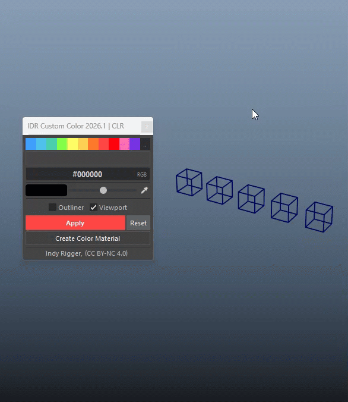

Displays the active color. Left-click to open the Maya Color Editor and select additional colors.

 
 

## Brightness

  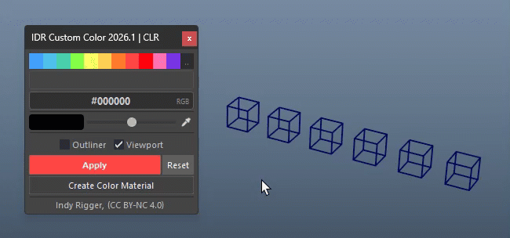

Adjust brightness before applying (no hue shift).

> <small>💡 0 = black · 50 = original · 100 = bright</small>

 
 

## Eyedropper

  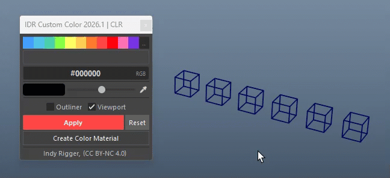

Pick any color from anywhere on screen. Features an 11×11 zoom preview grid with HEX readout in the color bar.

> <small>💡 Multi-monitor support with zoom preview</small>

 
 

## Favorite Presets

  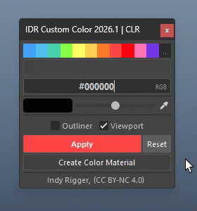

Store and reuse colors with 12 slots. Supports RGB, ACES, and Maya Index, with custom names and drag & drop.

- **Save**: Click an empty slot to store current color
- **Sort**: Move filled slots to the front
- **Blend**: Generate gradients between slots
- **Rename**: Name appears on hover
- **Auto Save**: Saved & restored automatically
File: `resources/presets/favorites.json`

> <small>💡 Share the JSON for team use</small>

 
 

## Built-in Palette Files

In addition to personal slots, the tool includes 8 ready-made palette files curated for rigging work:

| Palette | Description |
| --- | --- |
| Color Pastel 1 | Soft pastel tones |
| Rigging Controls 1 | Standard rig colors |
| Rigging Controls 2 | Extended rig colors |
| Toon – Lips Eyes Hair | Toon character features |
| Toon – Skin | Skin tones for toon rigs |
| Toon – Nature | Nature-themed toon colors |
| Toon – Sky | Sky and atmosphere tones |
| zIDR Code | IDR internal color code set |

  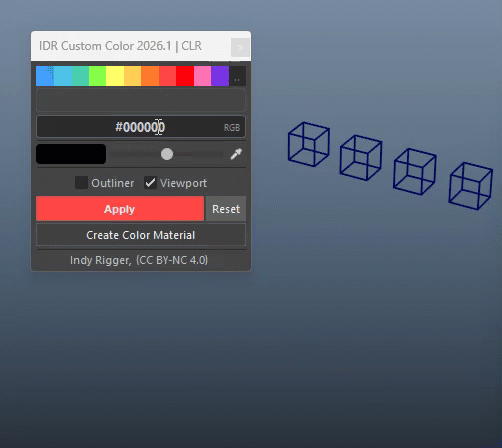

> <small>💡 User-saved palettes appear automatically in the menu.</small>

 
 

## Viewport & Outliner

  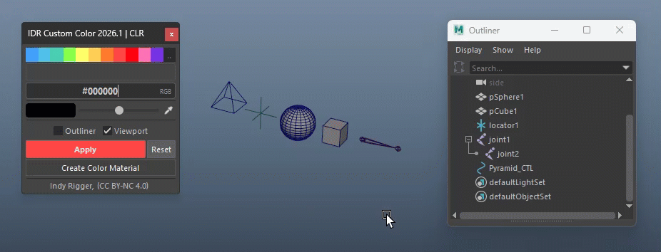

Choose whether color is applied to the Viewport (shape node), Outliner (transform node), or both.

- **Viewport**: Colors the shape node in the Maya scene
- **Outliner**: Colors the transform in the Outliner panel

 
 

## Apply & Reset

  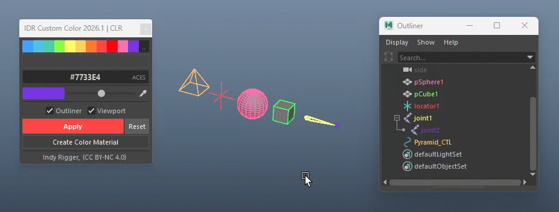

- **Apply**: Applies selected color to objects (Viewport / Outliner)
- **Reset**: Restores color to default (disables override)

 
 

## Random Color

  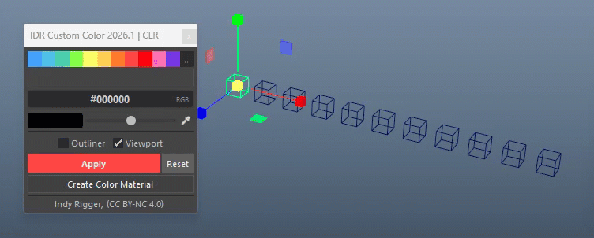

Assign random colors from 11 presets (no repeats if ≤11 objects).

> <small>💡 Auto reshuffle when exceeded</small>

 
 

## Rainbow Color

  

Distribute colors in sequence across objects.

> <small>💡 Auto interpolate if fewer objects than presets</small>

 
 

## Fade Dark / Light

  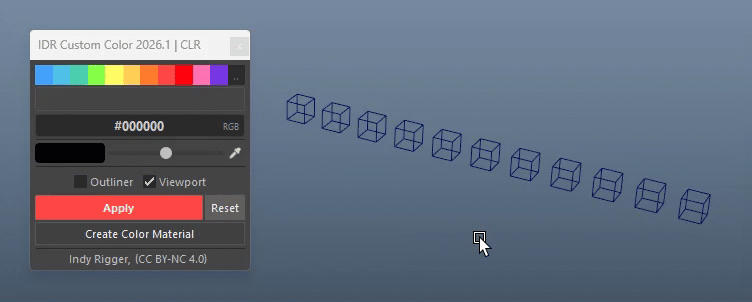

Fade color across selection (dark or light direction).

> <small>💡 Dark: progressively darker · Light: progressively brighter/desaturated</small>

 
 

## Display Type

  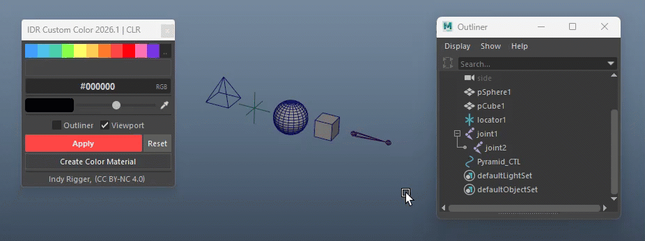

Set viewport display mode: **Normal / Template / Reference**

 
 

## Create Material

  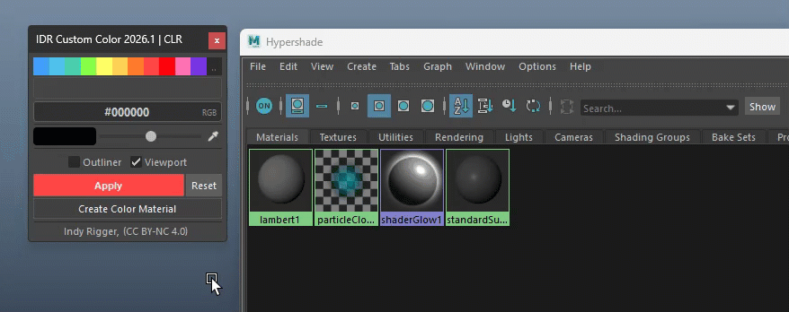

Create and assign a material directly from the current color.

> <small>💡 Supports: lambert / blinn / surfaceShader / standardSurface</small>

 
 

---

# 🔴 Troubleshooting

- **Viewport color mismatch**: RGB colors (HEX / Eyedropper) may differ in ACES mode. Use the ACES palette for accurate results.
- **Apply not working**: Ensure objects are selected and Viewport/Outliner checkbox is enabled. Locked or connected attributes are skipped.
- **Favorite slots reset**: Check that `favorites.json` exists in the presets folder.
- **Tool not opening / duplicate window**: Only one instance is allowed. Re-run the script to refocus or reopen.
- **Eyedropper not working**: Press Esc to cancel, or click the Maya viewport to refocus and try again.

 

# 🔴 Terminology

- **RGB / HEX / HSV**: Standard color formats. RGB uses 3 channels, HEX is #RRGGBB, HSV represents Hue, Saturation, Value.
- **Maya Index Color**: Legacy system with 31 fixed color IDs predefined in Maya.
- **ACEScg**: Wide color space used in VFX. In this tool, values are sampled from Maya ("Fake ACES") to match viewport colors visually.
- **Linear sRGB**: All RGB values are automatically converted before applying (no manual step required).
- **Override Color**: Applies color without a material using Maya override attributes. Reset disables this.
- **Viewport / Outliner**: Viewport applies to Shape Node (object color), Outliner applies to Transform Node (name color).
- **Shape Node / Transform Node**: Shape = geometry data, Transform = position/rotation/scale.
- **Shader / Material**: Creates and assigns a material from the selected color (Lambert, Blinn, etc.).
- **Undo Chunk**: Groups all actions so changes undo together in one Ctrl+Z.

 

## Get the Tools
Visit the official store for advanced scripts and premium rigging assets.

 

## Support This Project
If you find these tools helpful, consider supporting further development.

 

## Connect & Contact
Follow for the latest updates, tutorials, and more rigging content.

  

 
 

© 2026 Indy Rigger • Some rights reserved.

