# IDR RenameTools v2026.1
   [](https://creativecommons.org/licenses/by-nc/4.0/)

<br>

<p align="center">
  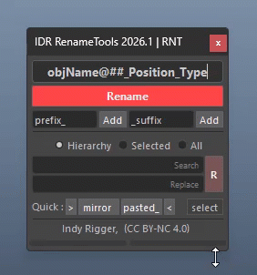
</p>

A powerful toolkit for fast and efficient naming in Autodesk Maya. Built for riggers and TDs, IDR RenameTools provides full-scene control across all DAG and DG nodes—featuring batch renaming, regex support, and custom tags in one streamlined, undo-friendly window.

> <small>💡 Switch between Page 1 (Rename Operation) and Page 2 (Type Setting) using the buttons at the bottom of the window.</small>

<br>

## Requirements

| Category | Specification |
| :--- | :--- |
| **Maya Version** | 2022, 2023, 2024, 2025+ |
| **Language** | Python 3.7+ |
| **UI Framework** | PySide2 (2022-2024), PySide6 (2025+) |
| **OS Support** | Windows, macOS, Linux |
| **License** | [CC BY-NC 4.0](https://creativecommons.org/licenses/by-nc/4.0/) |

<br>

## Installation

**Method 1: Drag & Drop (Recommended)**

1. Unzip the package
2. Place the folder (e.g., *Documents/maya/scripts*)
3. Open Maya
4. Drag **install.mel** into the Viewport
5. Shelf button is created automatically

<p align="center">
  
</p>

<br>

**Method 2: Manual Install**
Windows · macOS · Linux

1. Copy folder to: *~/maya/scripts/IDR_RenameTools_v2026.1*
2. Open Script Editor (Python) and run:

```python
import os
import sys

home_dir = os.path.expanduser("~")

paths = [
    os.path.join(home_dir, "Documents", "maya", "scripts", "IDR_RenameTools_v2026.1", "scripts"),
    os.path.join(home_dir, "maya", "scripts", "IDR_RenameTools_v2026.1", "scripts"),
]

for path in paths:
    if os.path.exists(path):
        sys.path.insert(0, path)
        break

import IDR_RenameTools
IDR_RenameTools.show()
```

<br>
<br>

## Type Setting

💡 Before starting, go to Type Setting and configure the Type or Suffix to match your pipeline. Settings are saved automatically and will persist the next time you open the tool.

<p align="center">
  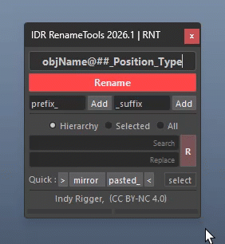
</p>

| **Field** | **Maya Type** | **Default** |
| :--- | :--- | :--- |
| **Mesh** | Mesh | GEO |
| **NURBS** | nurbsSurface | NUB |
| **Curve** | nurbsCurve | CUV |
| **Surface** | nurbsSurface (geo) | SRF |
| **Joint** | Joint | JNT |
| **Camera** | Camera | CAM |
| **Locator** | Locator | LOC |
| **Group** | transform (empty) | GRP |
| **Material** | lambert / material | MAT |
| **Shape** | Shape node suffix | SHP |
| **Left** | Left side token for Position | L |
| **Right** | Right side token for Position | R |
| **Center** | Center side token for Position | C |

1. Edit the abbreviation in the desired field
2. Click out of the field or press Tab — settings save automatically
3. The new value takes effect immediately for all operations using the Type or Position token

> <small>⚠️ RMB on any field in Page 2 → Reset: restores ALL type tag fields to their defaults at once.</small><br>
> <small>💡 Settings are saved to `rename_data.json` and loaded automatically on the next launch.</small>

<p align="center">
  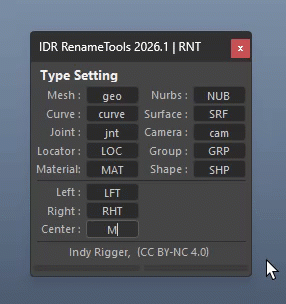
</p>

<br>
<br>

## Rename Field

Type a pattern in the rename field and press Enter or click **[Rename]** to rename all selected objects.

**Default pattern:** `objName@##_Position_Type`

<p align="center">
  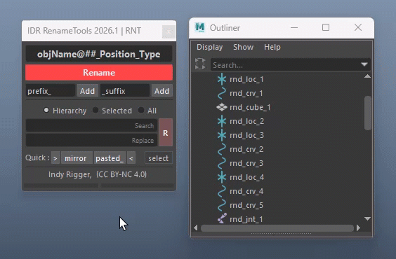
</p>

> <small>⚠️ Suffix, Type, and Position are all defined based on the **Type Setting.**</small>

<br>

### Pattern Tokens

| Token | Description | Examples |
| :--- | :--- | :--- |
| **##** | Sequential number | `#` → 1,2,3 / `##` → 01,02 / `###` → 001,002 |
| **##.5** | Set start value | `##.5` → 05,06,07 / `#.9` → 09,10,11 |
| **@** | Sequential letter A→Z (cycles) | `@` → A,B,C / `@@` → AA,BB |
| **oldName** | The object's current short name as-is | — |
| **Position** | Side token based on world-space X pivot | `Position` → L (left), R (right), C (center) |
| **Type** | Node type abbreviation | `Type` → JNT, GEO, CUV, LOC, GRP, etc. |

> <small>💡 Empty tokens are auto-collapsed (e.g., `arm__JNT` → `arm_JNT`).</small>

<br>

### Rename Pattern Examples

| Pattern | Description / Examples |
| :--- | :--- |
| `arm_##_JNT` | arm_01_JNT, arm_02_JNT, arm_03_JNT … |
| `char_@_CTL` | char_A_CTL, char_B_CTL, char_C_CTL … |
| `oldName_Type` | Keep original name + add type tag (e.g., spine → spine_JNT) |
| `Position_oldName` | Add side token as prefix (e.g., L_arm, R_arm) |
| `objName@##_Position_Type` | (Default) e.g., objNameA01_L_GEO, objNameB02_L_GEO |

<br>
<br>

## RMB Context Menus

### RMB on Rename Button

<p align="center">
  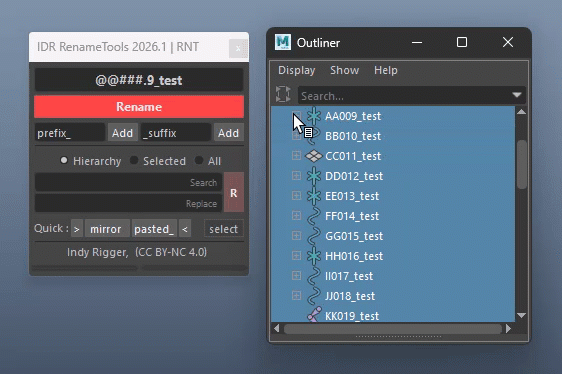
</p>

- **Rename Shape** — Rename shape nodes under selected transforms to `<name>_SHP`
- **Case Conversion**

| Format | Description | Example (Input → Output) |
| :--- | :--- | :--- |
| **UPPERCASE** | Converts all characters to capital letters | arm_ctrl → ARM_CTRL |
| **lowercase** | Converts all characters to small letters | Arm_CTRL → arm_ctrl |
| **Capitalize** | Capitalizes only the first letter of the string | arm_ctrl → Arm_ctrl |
| **Title Case** | Capitalizes the first letter of every word | arm_ctrl → Arm_Ctrl |
| **camelCase** | First word lowercase, next words capitalized | arm ctrl → armCtrl |
| **PascalCase** | Every word starts with an uppercase letter (no spaces) | arm ctrl → ArmCtrl |

- **Delete Namespace** — Deletes the namespace typed in the Rename field
- **Auto Rename Shape (toggle)** — When enabled, shape nodes are renamed automatically every time a transform is renamed

<br>

### RMB on Rename Field

<p align="center">
  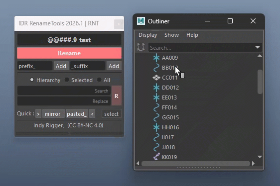
</p>

- **History menu** — Stores the last 20 patterns used; click any entry to reload it instantly
- **oldName_Type** — Keep original name + add type tag (e.g., spine → spine_JNT)
- **Clean..** — Clears all history after confirmation

> <small>💡 History is persisted to JSON and survives Maya restart.</small>

<br>
<br>

## Namespace Management

<p align="center">
  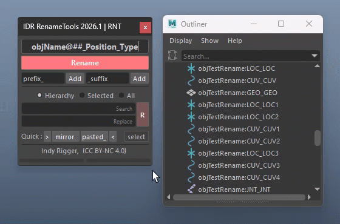
</p>

Delete a specific namespace:

1. Type the namespace name (e.g., `char1:`) into the rename field
2. Press Enter or click **[Rename]** — the tool detects `:` and removes that namespace

<br>
<br>

## Prefix — Add Prefix

<p align="center">
  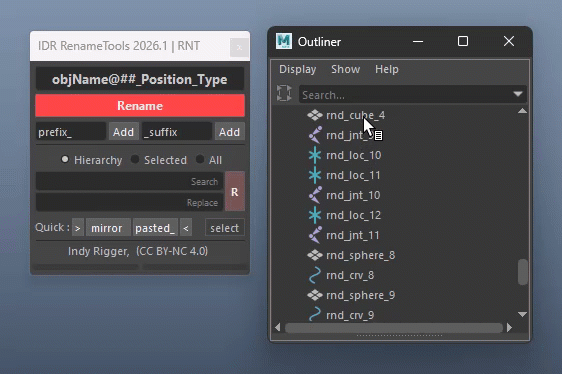
</p>

Type prefix text in the prefix field and click **[Add Prefix]** to prepend to selected objects' names.

- Supports all tokens: `##`, `@`, `Position`, `Type`, `oldName`

> <small>💡 Default: `prefix_` | RMB → Reset</small>

<br>
<br>

## Suffix — Add Suffix

<p align="center">
  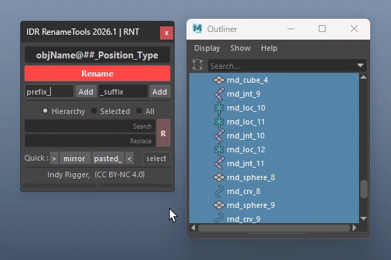
</p>

Type suffix text in the suffix field and click **[Add Suffix]** to append to selected objects' names.

- Supports all tokens: `##`, `@`, `Position`, `Type`, `oldName`

> <small>💡 Default: `_suffix` | RMB → Reset or choose `_Type` to quickly add type tag as suffix</small>

<br>
<br>

## Search & Replace

Enter search text and replacement text, then click **[R]**.

**Scope:**
- **Hierarchy** — Selected objects + all children
- **Selected** — Selected objects only
- **All** — Entire scene (DAG + DG)

<p align="center">
  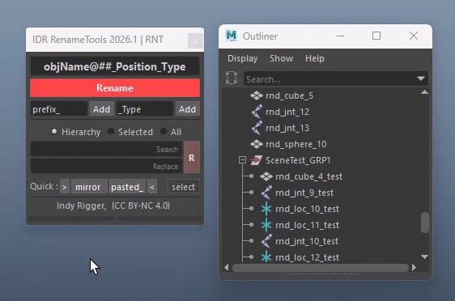
</p>

| Search | Replace | Example (Input → Output) |
| :--- | :--- | :--- |
| `arm` | `leg` | arm_L_CTL → leg_L_CTL |
| `_L` | `_R` | hand_L_JNT → hand_R_JNT |
| `_ctrl` | *(empty)* | arm_ctrl → arm *(empty replace = delete)* |

<br>

### Regex (Auto-Detected)

Regex mode activates automatically when special characters are used: **`^ $ \ [ ] ( ) + ? { } |`**

<p align="center">
  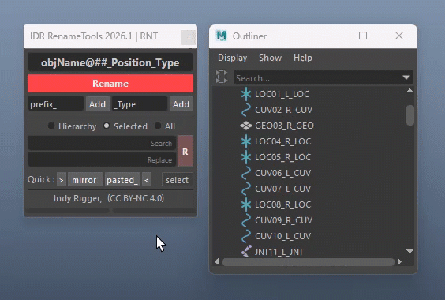
</p>

| Symbol | Meaning | Search | Replace | Example Result |
| :--- | :--- | :--- | :--- | :--- |
| `^` | Start of string | `^L_` | `R_` | L_arm → R_arm |
| `$` | End of string | `_JNT$` | `_CTL` | arm_JNT → arm_CTL |
| `.` | Any single character | `arm.` | `leg_` | arm1 → leg_ |
| `\` | Escape special characters | `\.` | `_` | arm.01 → arm_01 |
| `[ ]` | Match any in set | `[LR]_arm` | `C_arm` | L_arm → C_arm |
| `[^ ]` | Not in set | `[^L]_arm` | `X_arm` | R_arm → X_arm |
| `( )` | Group | `(arm\|leg)` | `limb` | arm → limb, leg → limb |
| `\|` | OR | `arm\|leg` | `limb` | arm → limb, leg → limb |
| `+` | One or more | `[0-9]+` | `01` | arm_5 → arm_01 |
| `*` | Zero or more | `arm_*` | `arm` | arm___ → arm |
| `?` | Optional | `arm_?L` | `leg_L` | armL → leg_L, arm_L → leg_L |
| `{ }` | Exact count | `[0-9]{2}` | `01` | arm_99 → arm_01 |
| `{ }` | Range | `[0-9]{1,3}` | `01` | arm_5 → arm_01, arm_123 → arm_01 |

Regex lets you target specific parts (prefix / suffix), handle multiple patterns at once, and rename large sets cleanly and safely.

<br>
<br>

## Quick Buttons**

<p align="center">
  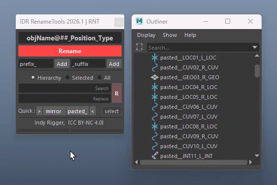
</p>

| Button | Action |
| :--- | :--- |
| **Trim Start (▸)** | Removes the first character from each selected object's name |
| **Mirror** | Swaps L ↔ R side token on selected objects |
| **pasted__** | Removes the `pasted__` prefix Maya auto-adds when pasting objects |
| **Trim End (◂)** | Removes the last character from each selected object's name |
| **Quick Select** | Opens a menu to select objects by type or find duplicate names |

<br>
<br>

## Mirror Rename

<p align="center">
  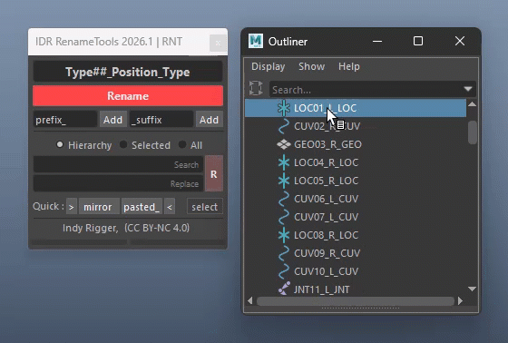
</p>

Swaps side tokens L ↔ R on all selected objects simultaneously.

1. Select the objects to mirror (can select both L and R sides at once)
2. Click **[Mirror Rename]**
3. Objects with L token become R and vice versa — objects with no side token are skipped

> <small>⚠️ Side tokens (L, R, C) can be customized in Page 2 → **Type Setting.**</small>

<br>
<br>

## Quick Select

<p align="center">
  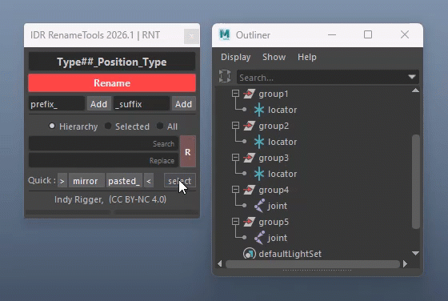
</p>

Click **[Quick Select]** to open the selection helper menu.

- **Duplicate Names** — Scan the scene and select all nodes that share a short name
- **By Type** — Select all nodes of that type: joint / curve / mesh / locator

<br>
<br>

## All-Node Rename (DAG + DG)**

<p align="center">
  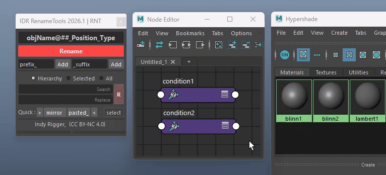
</p>

Rename and Search & Replace across all node types in one workflow.

- Supports DAG nodes (transform, joint, mesh) and DG nodes (materials, shaders, utility nodes)
- Protected and locked nodes are skipped automatically
- The `Type` token falls back to the Maya objectType name for DG nodes with no type tag defined
- The `Position` token resolves to empty for DG nodes (no world-space position)

<br>
<br>

---

# **🔴 Troubleshooting**

- **Rename does nothing** — No selection → Select objects first
- **Double underscores (`arm__JNT`)** — Empty tokens → Auto-fixed; check Type Settings
- **Invalid pattern warning** — Unsupported characters → Use A–Z, 0–9, `_` only
- **Wrong numbering (0 instead of 1)** — Using `#.0` → Use `#` / `##` for 1-based
- **@ not incrementing** — Only one object → Select multiple objects
- **Position empty** — DG node or X=0 → Use other token or adjust pivot
- **Type empty** — Not defined → Set in Page 2 (Type Setting)
- **Shape not renamed** — Disabled → Enable *Auto Rename Shape*
- **Wrong suffix (`_SHP`)** — Default value → Update Shape field in Page 2
- **Mirror Rename fails/skips** — Missing side token → Check `_L / _R` naming
- **Search & Replace no change** — Wrong scope or no match → Check scope & case
- **Regex error** — Invalid pattern → Fix syntax (test externally if needed)
- **Scope All affects too much** — Includes DG nodes → Use Selected / Hierarchy
- **Namespace not fully removed** — Nested → Delete from deepest level
- **History missing** — Cleared or corrupted → Reset `rename_data.json`
- **UI not responding** — Maya busy/error → Check Script Editor, reload tool

**Quick Fix Checklist:**
Select objects first → Check pattern (no invalid characters) → Verify Type Tags (Page 2) → Confirm S&R scope → Check Script Editor for errors → Restart Maya if needed

<br>

# **🔴 Terminology**

- **Token** — Placeholder (e.g., `##`, `@`, `Type`)
- **## / #** — Number sequence (digit count = length)
- **@** — Letter sequence (A→Z)
- **oldName** — Original object name
- **Position** — L / R / C (based on X axis)
- **Type** — Custom type tag (set in Page 2)
- **DAG node** — Has hierarchy (transform, joint, mesh)
- **DG node** — No hierarchy (blendColors, animCurve, etc.)
- **Transform** — Position/rotation/scale node
- **Shape** — Geometry node under transform
- **Regex (Regular Expression)** — Pattern-based matching for complex renaming
- **Namespace** — A naming scope in Maya (e.g., `char1:arm`)
- **Batch Rename** — Renames multiple objects at once using a pattern with tokens

<br>

## Get the Tools
Visit the official store for advanced scripts and premium rigging assets.

[](https://indyrigger.gumroad.com/)

<br>

## Support This Project
If you find these tools helpful, consider supporting further development.

[](https://buymeacoffee.com/indyrigger)

<br>

## Connect & Contact
Follow for the latest updates, tutorials, and more rigging content.

[](https://www.facebook.com/indyrigger) [](https://www.youtube.com/indyrigger) [](mailto:rigger.indy@gmail.com)

<br>
<br>

<p align="center">
© 2026 Indy Rigger • Some rights reserved.
</p>