# IDR RepathTexture v2026.1
     

 

  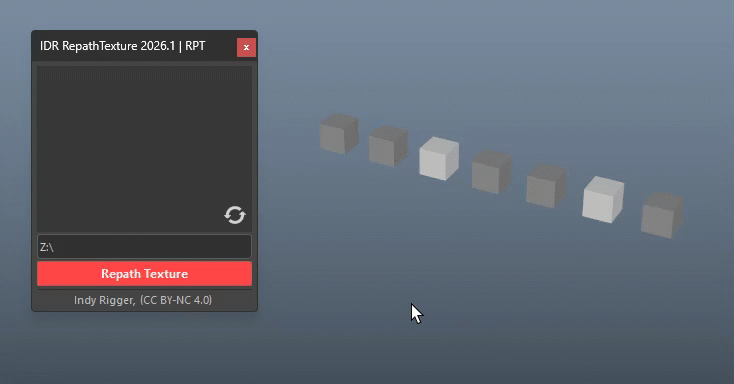

A powerful toolkit for resolving broken texture paths in Autodesk Maya — IDR RepathTexture scans every file texture node in your scene, displays live found/missing status per texture, and reconnects all missing files in a single click.

 

# Installation Guide

👉 **[Install Tools](../Install-Tools.md)**

 

# Quick Walkthrough

1. When you open the file and textures are missing.
2. Launch the IDR RepathTexture tool.
3. The texture list will appear in the UI.
4. Red button = File not found.
5. Select the texture folder (Right-click > Browse Folder...).
6. Click RepathTexture.
7. 🔴Red → 🟢Green = Paths successfully reconnected.
8. If any remain red, manually assign them (Right-click > Browse File...).
9. After selecting the file, the button turns green.

  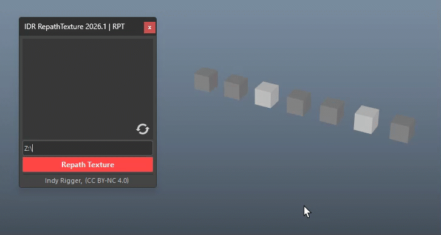

 
 

# UI Walkthrough
## Texture List

Displays all **file texture nodes** found in the current scene. Each row represents one file node.

  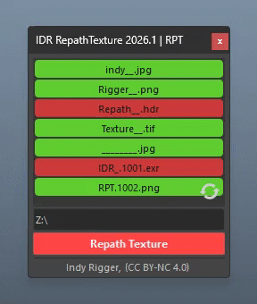

| Color | Meaning |
| :--- | :--- |
| 🟢 **Green** | File exists on disk at the stored path |
| 🔴 **Red** | File not found — path is broken or missing |

- The list is populated automatically when the tool opens
- Each row displays the **filename** of the texture (not the full path)
- Hover over any row to see the **full path** and **node name** in a tooltip

 

## Refresh Button

A spinning icon button overlaid in the bottom-right corner of the texture list. Click it to **re-scan** all file nodes in the scene and update the list.

  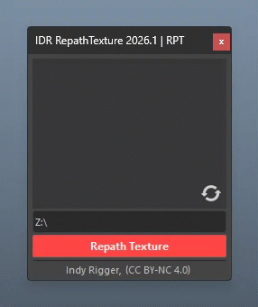

Use Refresh after:
- Opening a new scene or importing objects
- Manually editing texture paths in the Attribute Editor
- Adding new file nodes

 
 

## Select Texture Node

**Click any texture row** to select that file node in Maya's scene (equivalent to selecting it in the Node Editor or Hypershade).

  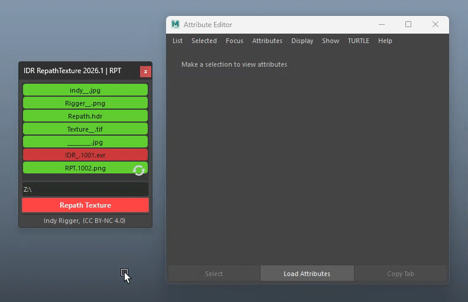

> <small>💡 After selecting the node, you can inspect or edit its attributes directly in the Attribute Editor.</small>

 
 

## Right-Click Row
 
**Right-click any texture row** to open a context menu with the following actions:
 
| Menu Item | Behavior |
| :--- | :--- |
| **Browse File...** | Opens a file browser starting from the node's current directory — lets you pick a replacement texture file directly for this node only |
| **Clear Slot** | Removes this row from the texture list (does not affect the Maya scene) |
| **Clear Slot All** | Removes all rows from the texture list (does not affect the Maya scene) |
 

  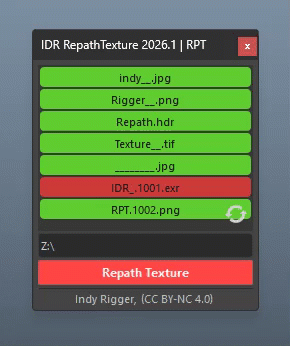

- Useful when the **filename has changed** (not just the directory)
- The operation is wrapped in a **single undo step** (`Ctrl+Z` to revert)
- After picking a file, the row updates immediately to reflect the new status

 
 

## Target Path Field

The text field where you enter or paste the **directory path** to search for textures.

- Auto-filled on launch with the **scene file's directory**, or the **project root** if the scene is unsaved
- You can type or paste a path directly

### Right-Click Path Field — Path Menu

**Right-click the Target Path field** to open a context menu for managing the path:

  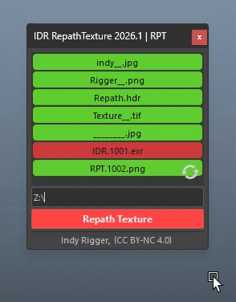

| Menu Item | Behavior |
| :--- | :--- |
| **Browse Folder...** | Opens Maya's folder browser dialog to pick a directory |
| **Open Folder** | Opens the current path in the system's file explorer (Explorer / Finder / Files) |
| **Go Back** | Navigates up one directory level (disabled if already at root) |
| **Use Scene Path** | Fills the field with the current scene file's directory |
| **Reset Path** | Restores the default path (scene dir → project root → empty) |

> <small>💡 **Open Folder** supports Windows, macOS, and Linux.</small>

 
 

## Apply Repath

**Repath Texture button** — the main action button. It searches the target directory and reconnects all file texture nodes where matching files are found.

  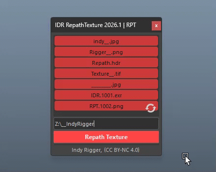

**Workflow:**
1. Enter a directory path in the Target Path field
2. Click **Repath Texture**
3. A **Smart Path Check** runs first (see below)
4. If safe, a **Progress Dialog** will appear while the tool searches for texture files.
5. On completion, all matched nodes are updated and the texture list refreshes

> <small>💡 Results are printed to the **Script Editor**.</small>

 

## Smart Path Check

Before any search begins, the path is validated automatically. The tool will show a warning or block the operation depending on what it detects:

| Condition | Level | Behavior |
| :--- | :--- | :--- |
| Path does not exist | ⛔ **Block** | Operation blocked — fix the path first |
| System folder detected (`Windows`, `Program Files`, etc.) | ⛔ **Block** | Operation blocked — system directories are not allowed |
| Network path (`\\server\...`) | ⚠️ **Warn** | Warning shown — you can still Continue or Cancel |
| Root drive selected (`C:\`, `/`) | ⚠️ **Warn** | Warning shown — full drive scan may be slow |
| Valid directory | ✅ **Safe** | Proceeds immediately |

  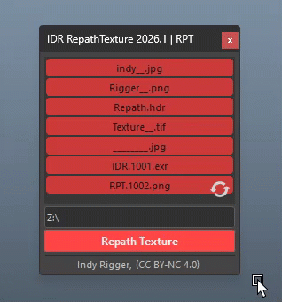

 

## Progress Dialog

Appears while the background directory indexing is running. Displays current scan progress as a percentage.

  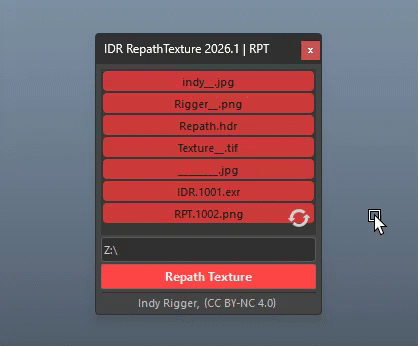

| Control | Behavior |
| :--- | :--- |
| **Progress Bar** | Shows percentage of directories scanned |
| **Status Label** | Shows `Scanning...` (directories scanned / total) |
| **Esc** | Cancels the background search — no changes are applied |

> <small>💡 Cancelling via Esc is safe — the undo chunk is never opened if the search is cancelled before completion.</small>

 
 

## Clear Texture Path

**Right-click the Repath Texture button** to access a special utility action:

  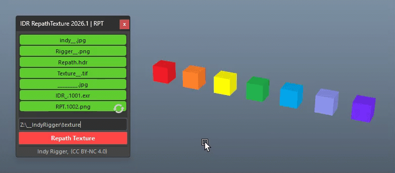

| Menu Item | Behavior |
| :--- | :--- |
| **Clear Texture Path** | Strips the directory from all file nodes — leaves filename only (no path) |

- Useful when **packaging or archiving** a scene — removes absolute paths so textures can be resolved relative to any location
- Wrapped in a **single undo step**
- Result is printed: `Cut path — X/Y nodes updated`

> <small>💡 After clearing, all entries turn 🔴 red (filename-only, file not found). This is expected—click Apply Repath to restore paths.</small>

 
 

## Search & Match Logic

Even if the extension has changed, as long as the file name remains the same, the tool will automatically search for the texture and relink it for you.

For example, Maya may store the texture path as:
`Z:\IndyRigger\textures\diffuse_color.png`

But you moved the file to:
`D:\InderRiggy\assets\char\diffuse_color.exr`

 

  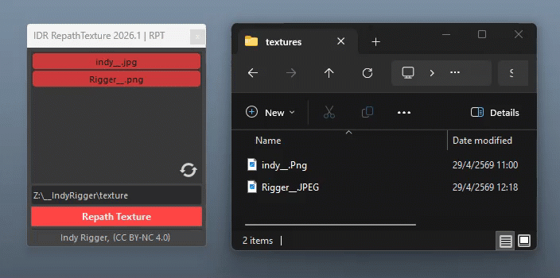

 

Even when everything has changed—the extension and the file is buried deep in subfolders—the tool will automatically search and relink it based on the path you selected, using the following priority order:

| Priority | Rule | Example |
| :--- | :--- | :--- |
| **1 — Exact match** | Same filename, case-insensitive | Search `diffuse_color.png` → found `diffuse_color.png` ✅ |
| **2 — Same extension** | Same stem + same extension, case differs | Search `diffuse_color.PNG` → found `diffuse_color.png` ✅ |
| **3 — Extension priority** | Same stem, best extension by ranked list | Search `diffuse_color.png` → only `diffuse_color.exr` found → use `.exr` (higher priority) ✅ |
| **4 — First available** | Same stem, any extension | No match in priority list → use the first available file found ✅ |

**Extension Priority Order (highest → lowest):**

`.exr` → `.tx` → `.rstex` → `.png` → `.tga` → `.tif` / `.tiff` → `.jpg` / `.jpeg` → `.bmp` → `.hdr`

 
 

---

# **🔴 Troubleshooting**

- **Texture list is empty on open** — No file nodes in scene → Open a scene with textures, then Refresh
- **All rows stay red after repath** — Wrong directory → Verify the path contains the texture files; try a parent folder
- **Some textures not found** — Filename changed → Use RMB → Browse File on individual rows to pick manually
- **"Directory not found" block** — Path typo or unmapped drive → Check the path exists before proceeding
- **"System folder" block** — System path entered → Choose a project or asset directory instead
- **Network search is very slow** — Large network share → Browse to a more specific subfolder
- **Esc does not cancel immediately** — Worker finishes current directory first → Allow a moment; cancel takes effect at the next directory boundary
- **Ctrl+Z does not undo** — Multiple undo steps needed (Maya selection stack) → Normal behavior; press Ctrl+Z once for the repath operation
- **Open Folder does nothing** — Path not found → Verify the path exists and is accessible
- **Tool window appears empty** — `.ui` file missing → Verify `IDR_mainUI.ui` is present in the `IDR_RepathTexture_core/ui/` folder
- **Path field auto-fills wrong directory** — Scene not saved → Save the scene first; otherwise the project root is used

**Quick Fix Checklist:**
Click Refresh → Verify target path → Check Smart Path result → Run Apply Repath → Check Script Editor for count → RMB individual rows for stubborn mismatches

 

# **🔴 Terminology**

- **File Texture Node** — Maya node (`file` type) that stores the path to an image file and feeds it into a shader
- **fileTextureName** — The attribute on a `file` node that holds the texture's full path
- **Repath** — The process of updating a file node's path attribute to point to a valid file location
- **Stem** — The filename without its extension (e.g., `diffuse_color` from `diffuse_color.png`)
- **Extension Priority** — Ranked list of texture formats used when multiple files share the same stem
- **Recursive Search** — Walking through all subdirectories of a root folder, not just the top level
- **Background Thread** — A `QThread` that performs the directory scan without blocking Maya's UI
- **Smart Path Check** — Pre-validation step that blocks unsafe paths (system folders, missing directories) before any scan begins

 

## Get the Tools
Visit the official store for advanced scripts and premium rigging assets.

 

## Support This Project
If you find these tools helpful, consider supporting further development.

 

## Connect & Contact
Follow for the latest updates, tutorials, and more rigging content.

  

 
 

© 2026 Indy Rigger • Some rights reserved.

