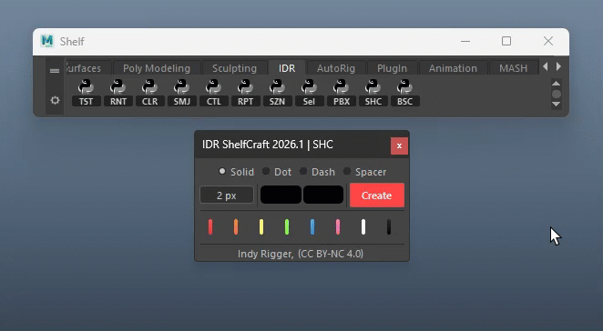
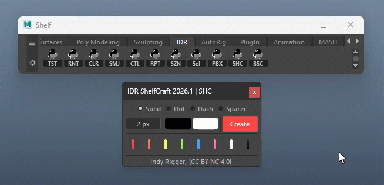

# IDR ShelfCraft v2026.1
     

 

  

A powerful toolkit for creating and managing visual separators on Maya shelves — eliminating the tedious manual process of shelf organization. IDR ShelfCraft lets you generate pixel-perfect color bars, gradient dividers, dotted/dashed pattern separators, and transparent spacers directly from a live UI, save them as reusable presets, and deploy them onto any shelf tab in a single click. All settings and presets persist automatically across Maya sessions.

 

## Installation Guide

👉 **[Install Tools](../Install-Tools.md)**

 

# Quick Walkthrough

1. To organize your Maya Shelf, open the IDR ShelfCraft tool.
2. Choose one of the 8 available color presets.
3. Click on your desired color.
4. A colored separator line will be created on your Shelf.
5. Use middle mouse drag to reposition the separator anywhere you like.

  

 
 

# UI Walkthrough
## Style Row

Selects the visual type of the separator. Four radio buttons at the top of the window — mutually exclusive.

  

| Style | Result | Default Width |
| :--- | :--- | :--- |
| **Solid** | Filled rectangular bar. Auto-upgrades to left→right gradient when Color A ≠ Color B | 2 px |
| **Dotted** | Row of circular dots alternating between Color A and Color B | 20 px |
| **Dashed** | Row of rectangular dashes alternating Color A → B → A | 20 px |
| **Spacer** | 100% transparent gap — no visible pixels | 200 px |

> <small>💡 Switching any radio button automatically resets the Width field to that style's default value.
> 💡 In Spacer mode, color buttons are disabled—color has no effect.</small>

 
 

## Settings Row
### Width Field

Controls separator width in pixels. Minimum enforced value is **2 px**. Always displays in the format **N px**.

  

| Interaction | Action |
| :--- | :--- |
| **Left-click → type** | Enter any integer, press Enter to confirm |
| **RMB** | Quick-set menu: `2 px` / `20 px` / `200 px` / `500 px` |
| **MMB drag** | Hold Middle Mouse and drag left/right — scrubs 1 px per pixel dragged |
| **Ctrl + MMB drag** | Scrub at ×10 speed — 10 px change per pixel dragged |

> <small>💡 **RMB Quick-set** is the fastest way to jump between common separator widths without typing.</small>

 
 

### Color A

Primary color. Displays as a filled swatch — tooltip shows the hex code.

  

| Interaction | Action |
| :--- | :--- |
| **Left-click** | Opens Qt Color Dialog. **Also sets Color B to the same value automatically.** |
| **RMB** | Quick-color menu — 9 named presets with color swatches |

**Quick-color presets (available on RMB for both Color A and Color B):**

| Name | Hex |
| :--- | :--- |
| Indy Red | `#FF4545` |
| Orange | `#FF7A2C` |
| Yellow | `#FFFF63` |
| Green | `#86FF46` |
| Blue | `#41A0FF` |
| Purple | `#7733E4` |
| Pink | `#FF71B4` |
| Black | `#000000` |
| White | `#FFFFFF` |

> <small>💡 Picking Color A always syncs Color B to the same value. Adjust Color B afterward only if you need a gradient effect.</small>

 
 

### Color B

Secondary color — independent. If A = B, a subtle vertical gradient is used; if different, a horizontal gradient is applied.

  

| Interaction | Action |
| :--- | :--- |
| **Left-click** | Opens Qt Color Dialog independently — does **not** affect Color A |
| **RMB** | Quick-color menu — same 9 presets (sets Color B only) |
| **Spacer mode** | Button disabled, frosted-glass appearance |
> <small>💡 Picking Color A always syncs Color B to the same value. Adjust Color B afterward only if you need a gradient effect.</small>

 
 

### Create Button

Generates the separator PNG icon and saves it as a new preset.

  

| Interaction | Action |
| :--- | :--- |
| **Left-click** | Build PNG icon → save to Preset Area. Duplicate entries (same Style + Color A + Color B + Width) are rejected automatically. |
| **RMB** | Context menu → **Reset** — resets Style to Solid, both colors to Black (`#000000`), Width to 2 px |

> <small>💡 PNGs are saved to `IDR_ShelfCraft_core/icons/.` Presets are stored in `session.json` and persist after restart.</small>

 
 

## Preset Area

The middle section displays all presets as thumbnail buttons in a FlowLayout, wrapping automatically with no limit.

  

| Interaction | Action |
| :--- | :--- |
| **Left-click** | Adds that separator as a `shelfButton` to the **currently active Maya shelf tab** |
| **RMB → Reset** | Clears all presets and reloads the 8 factory defaults from `default.json` |
| **RMB → Delete** | Removes this preset and **deletes its icon PNG from disk** (protected default icons are never deleted) |

> <small>💡 **Spacer preset buttons** are rendered at 25×25 px with a dotted border to indicate transparent content.
> 💡 **Auto-rebuild:** If the icon PNG is missing when you click a preset, it is automatically rebuilt before being placed on the shelf.</small>

 
 

## Default Presets

**RMB → Reset** on any preset restores these 8 factory presets from `default.json`:

| Name | Color | Style | Width |
| :--- | :--- | :--- | :--- |
| Indy Red | `#FF4545` | Solid | 2 px |
| Vibrant Orange | `#FF7A2C` | Solid | 2 px |
| Lemon Yellow | `#FFFF63` | Solid | 2 px |
| Neon Green | `#86FF46` | Solid | 2 px |
| Sky Blue | `#41A0FF` | Solid | 2 px |
| Taffy (Pink) | `#FF71B4` | Solid | 2 px |
| Pure White | `#FFFFFF` | Solid | 2 px |
| Charcoal | `#161616` | Solid | 2 px |

> <small>💡 Icon files for these 8 defaults are permanently protected — **Delete will never remove them from disk.**</small>

 
 

# **🔴 Troubleshooting**

- **Tool window does not open** — Check Maya version (2022+ required) → Open Script Editor and look for `ImportError` or `AttributeError`
- **"Add failed." in viewport** — No active shelf tab → Click any shelf tab to make it active, then try again
- **Preset area empty after restart** — `session.json` deleted or corrupted → RMB → **Reset** to restore 8 defaults, or delete `session.json` and reopen the tool
- **"Duplicate." message on Create** — Same Style + Color A + Color B + Width already exists → Change any one parameter and click Create again
- **Preset thumbnail shows no icon** — PNG manually deleted → Click the preset normally — icon auto-rebuilds before shelf placement
- **Window does not resize** — Qt layout timing edge case (rare) → Close and reopen the tool; height recalculates on startup

 

# **🔴 Terminology**

- **Separator** — A thin visible element placed on the Maya shelf to divide groups of tool buttons
- **Spacer** — A transparent (invisible) gap element — no color or pattern, only width
- **Solid** — Style producing a filled rectangular bar; renders as gradient when Color A ≠ Color B
- **Gradient** — Smooth color transition from Color A (left) to Color B (right); applied automatically in Solid mode when the two colors differ
- **Dotted** — Style producing a horizontal row of alternating-color circular dots
- **Dashed** — Style producing a horizontal row of alternating-color rectangular dashes
- **Color A** — Primary / left color; picking via dialog also copies the value to Color B automatically
- **Color B** — Secondary / right color — independent; changing it does not affect Color A
- **Preset** — A saved separator configuration (Style + Color A + Color B + Width) shown as a thumbnail button
- **default.json** — Defines the 8 protected factory-default presets; their PNG icons are undeletable
- **session.json** — Auto-saved file storing all current presets and last-used settings (style, colors, width)
- **FlowLayout** — Custom Qt layout that wraps preset buttons to new rows automatically when width is exhausted
- **shelfButton** — Maya UI element placed on a shelf tab; ShelfCraft creates one per separator added
- **PAD** — 5 px transparent margin on each side of the separator PNG, preventing icon clipping on the shelf
- **Frosted-glass** — Visual style applied to Color buttons in Spacer mode, indicating they are disabled

 
 

## Get the Tools
Visit the official store for advanced scripts and premium rigging assets.

 

## Support This Project
If you find these tools helpful, consider supporting further development.

 

## Connect & Contact
Follow for the latest updates, tutorials, and more rigging content.

  

 

© 2026 Indy Rigger • Some rights reserved.

