# IDR SmartJoint v2026.1
   [](https://creativecommons.org/licenses/by-nc/4.0/)

<br>

<p align="center">
  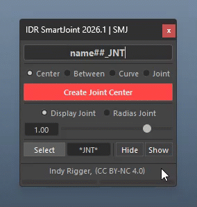
</p>

A powerful toolkit for joint creation and orientation in Autodesk Maya, IDR SmartJoint covers every rigging step—from generating joints from objects and components to mirroring and orienting with multiple professional methods.

> <small>💡 Switch between Page 1 (Create Joint / Locator) and Page 2 (Orient Joint / Axis) using the buttons at the bottom of the window.</small>

<br>

## Requirements

| Category | Specification |
| :--- | :--- |
| **Maya Version** | 2022, 2023, 2024, 2025+ |
| **Language** | Python 3.7+ |
| **UI Framework** | PySide2 (2022-2024), PySide6 (2025+) |
| **OS Support** | Windows, macOS, Linux |
| **License** | [CC BY-NC 4.0](https://creativecommons.org/licenses/by-nc/4.0/) |

<br>

## Installation

**Method 1: Drag & Drop (Recommended)**

1. Unzip the package
2. Place the folder (e.g., *Documents/maya/scripts*)
3. Open Maya
4. Drag **install.mel** into the Viewport
5. Shelf button is created automatically

<p align="center">
  
</p>

<br>

**Method 2: Manual Install**
Windows · macOS · Linux

1. Copy folder to: *~/maya/scripts/IDR_SmartJoint_v2026.1*
2. Open Script Editor (Python) and run:

```python
import os
import sys

home_dir = os.path.expanduser("~")

paths = [
    os.path.join(home_dir, "Documents", "maya", "scripts", "IDR_SmartJoint_v2026.1", "scripts"),
    os.path.join(home_dir, "maya", "scripts", "IDR_SmartJoint_v2026.1", "scripts"),
]

for path in paths:
    if os.path.exists(path):
        sys.path.insert(0, path)
        break

import IDR_ControllerTools
IDR_ControllerTools.show()
```

<br>
<br>

# Page 1 — Create Joint / Locator

## Name Pattern

Enter a name in the Name Pattern field before pressing Create. Use `#` characters to define zero-padding.

| Pattern | Result | Notes |
| :--- | :--- | :--- |
| `arm##_JNT` | arm01_JNT, arm02_JNT | 2-digit padding |
| `arm#_JNT` | arm1_JNT, arm2_JNT | No padding |
| `arm###_JNT` | arm001_JNT, arm002_JNT | 3-digit padding |
| `spine_JNT` | spine_JNT (all) | No # → Maya auto-appends suffix |

<p align="center">
  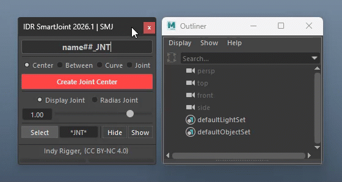
</p>

> <small>💡 History — Right-click the Name Pattern field to recall previously used names or click Clear... to wipe history.</small>

<br>

## Create Joint Center

Creates one joint per selected object, placed at the Bounding Box center with rotation matched from the source object.

| # | Selection | Result |
| :--- | :--- | :--- |
| **1** | Nothing selected | 1 joint at origin (0, 0, 0) |
| **2** | Mesh / NURBS / Curve | Joint at Bbox center + Match Rotation from object |
| **3** | Joint / Group / Locator | Joint at pivot + Match Rotation from object |
| **4** | Vertex / CV / Edit-point | Joint at component position (no rotation match) |
| **5** | Face | Joint at face center (no rotation match) |
| **6** | Multiple objects | One joint per object, all rules above apply |

<p align="center">
  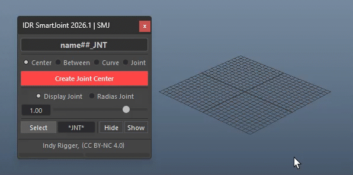
</p>

<br>

## Create Joint Between

Creates exactly one joint at the Bounding Box center of all selected objects combined.

1. Select 2 or more objects, components, or joints
2. Press **[Create Joint Between]**

<p align="center">
  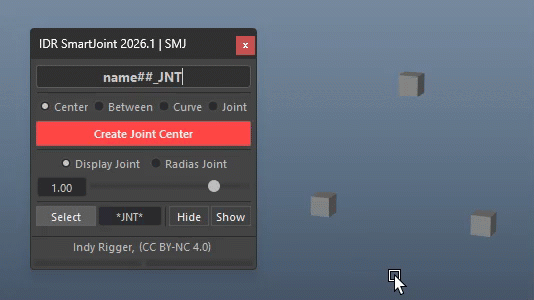
</p>

> <small>💡 Different from Center — Between merges all selections into one joint and does not match rotation.</small>

<br>

## Create Joint on Curve

Creates multiple joints distributed along a NURBS curve.

| # | Step | Details |
| :--- | :--- | :--- |
| **1** | Select a NURBS Curve | Transform or shape node both work |
| **2** | Set Joint Count | Number of joints along the curve (minimum 2) |
| **3** | Set Spacing Bias | See Spacing Bias section below |
| **4** | Press Create Joint on Curve | Joints created and selected |

<p align="center">
  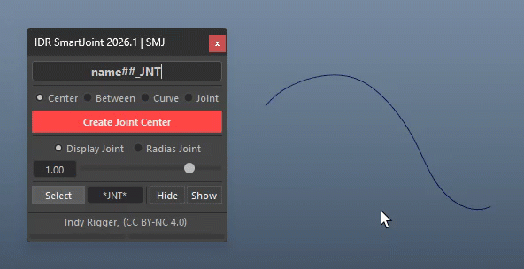
</p>

> <small>💡 **Realtime Bias:** After creation, drag the Bias slider immediately to redistribute joints without recreating them.</small>

<br>

## Create Joint on Joint

Inserts joints between two endpoint joints.

| Selection | Mode | Result |
| :--- | :--- | :--- |
| 1 joint (with child) | **Chain Mode** | Inserts between that joint and its first child; rebuilds hierarchy |
| 2 or more joints | **Free Mode** | Inserts between sel[0] and sel[-1] (no hierarchy required) |

<p align="center">
  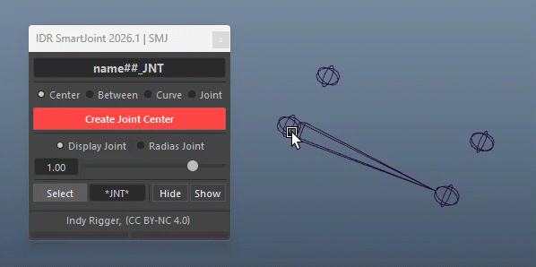
</p>

> <small>💡 In Chain mode, rename covers the entire chain: start + inserted + end joints.</small>

<br>

## Spacing Bias

The Bias slider appears only in Curve and Joint modes. It controls the spacing distribution of joints.

| Bias Value | Effect | Use Case |
| :--- | :--- | :--- |
| 0 (center) | Uniform spacing | General purpose |
| Left (−1) | Dense at start (ease-in) | Emphasize root area, e.g. spine root |
| Right (+1) | Dense at end (ease-out) | Emphasize tip area, e.g. finger tips |

<p align="center">
  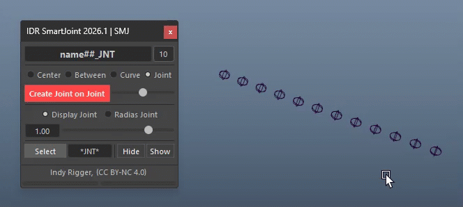
</p>

> <small>💡 Drag the slider in realtime after Create — joints reposition without recreating.</small><br>
> <small>💡 RMB → Reset → returns Bias to 0.</small>

<br>

## Switch Joint / Locator Mode

The Create button works for both Joints and Locators.

**RMB → Joint or Locator → switch mode**

<p align="center">
  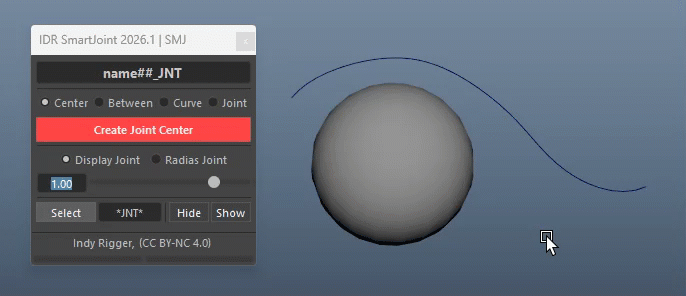
</p>

When switched to Locator mode:

- Name pattern auto-changes `_JNT` → `_LOC`
- Size slider switches to Local Scale
- Suffix pattern changes to *LOC*
- Page 2 (Orient) is disabled except Show/Hide Axis

<br>

## Joint Size / Display Scale

Controls joint display size, Radius Joint, and Locator Scale in the viewport.

| Control | Behavior |
| :--- | :--- |
| **Slider** | Adjusts global Joint Display Scale — log scale, range 0.01–10 |
| **Text Box** | Type a value and press Enter; accepts values beyond 10 |
| **MMB Drag on Text Box** | Drag Middle Mouse on text box to increment/decrement (Ctrl = fine) |
| **Ctrl + Arrow on Slider** | Adjust 1 step at a time for fine control |
| **Radio: Display** | Global jointDisplayScale mode |
| **Radio: Radius** | Per-joint radius mode (select joints first) |
| **Radio: Locator** | Resize locator display without affecting Transform values |

<p align="center">
  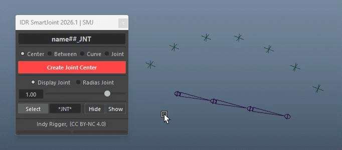
</p>

> <small>💡 RMB → Reset → resets size to 1.00.</small>

<br>

## Hide / Show Joints

- **Hide Joints** — sets drawStyle to hidden on selected joints
- **Show Joints** — sets drawStyle to bone on selected joints

<p align="center">
  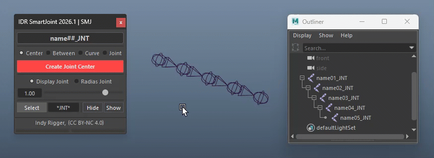
</p>

> <small>💡 Select joints before pressing either button.</small>

<br>

## Select by Suffix

Select all objects whose names match a suffix pattern.

1. Enter a pattern in the **Suffix** field (e.g. `JNT*`, `L_*_JNT`)
2. Click **[Select]** or press **Enter**

<p align="center">
  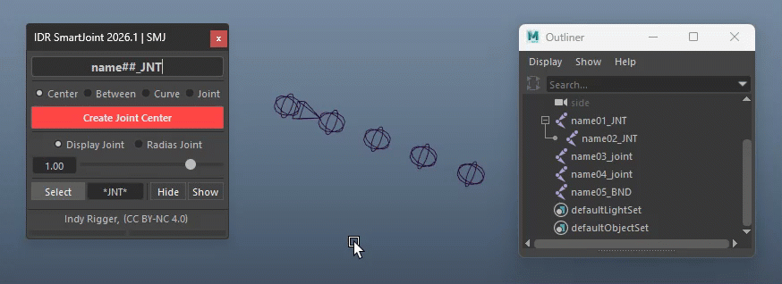
</p>

**Wildcards:** `*` = any characters · `?` = single character

> <small>💡 See the Terminology section for Wildcard Reference.</small><br>
> <small>💡 History: Right-click the Suffix field to recall previous patterns.</small>

<br>
<br>

# Page 2 — Orient Joint

**Orient button:** LMB to apply orient in the current mode | RMB to select orient mode

<p align="center">
  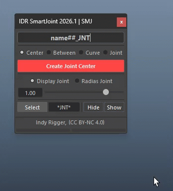
</p>

> <small>💡 Choose the orientation method that best fits your current workflow.</small>

<br>

## Orient Joints

Orients joints using Aim Constraint based on the configured axes.

| Setting | Description |
| :--- | :--- |
| **Aim Axis (X/Y/Z)** | The axis that points toward the next child joint |
| **Rev Aim** | Flips aim direction (e.g. +X → −X) |
| **Up Axis (X/Y/Z)** | The axis that points upward |
| **Rev Up** | Flips up direction |
| **World Up Dir** | Sets the world up vector (choose axis + numeric value) |

1. Select joints
2. Choose Aim Axis and Up Axis
3. Set World Up Direction
4. Press **[Orient Joints]**

<p align="center">
  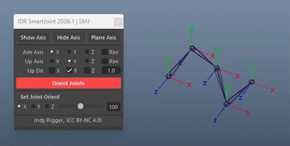
</p>

> <small>💡 **Last joint:** If it has no child, it automatically copies orientation from the previous joint.</small>

<br>

## Orient to World

Zeros all jointOrient attributes so the joint aligns with world space.

1. Select joints
2. RMB Orient Joints → Orient to World
3. Press **[Orient to World]**

<p align="center">
  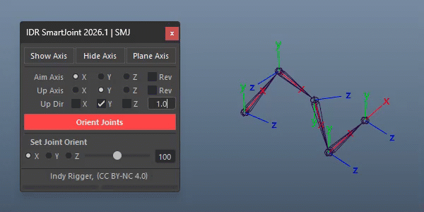
</p>

<br>

## Orient to Normal

Orients joints so the Aim Axis points along the surface normal at the closest point.

1. Select joints first
2. Shift+click a surface, face, vertex, or edge last
3. RMB Orient Joints → Orient to Normal
4. Press **[Orient to Normal]**

<p align="center">
  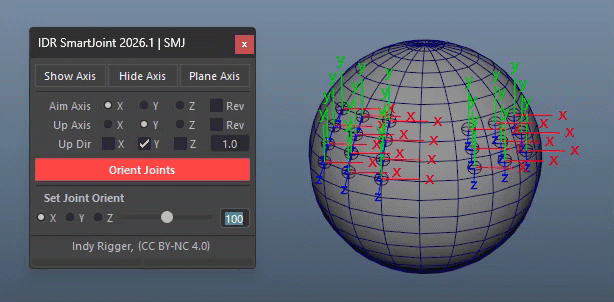
</p>

> <small>💡 **Supports:** Mesh Face (.f[]), Vertex (.vtx[]), Edge (.e[]), Mesh Transform (closestPoint), NURBS Surface.</small>

<br>

## Orient to Curve

Orients joints so the Aim Axis points along the curve tangent at the closest point.

1. Select joints first
2. Shift+click a NURBS Curve last
3. RMB Orient Joints → Orient to Curve
4. Press **[Orient to Curve]**

<p align="center">
  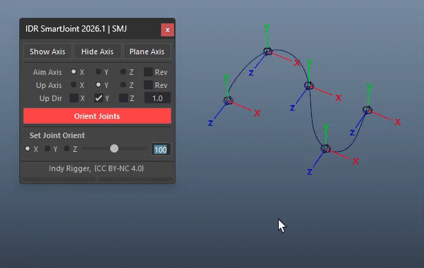
</p>

<br>

## Orient to Target Aim (Recommended)

Creates interactive aim locators. Move the locators to set aim and up directions before applying.

| # | Step | Details |
| :--- | :--- | :--- |
| **1** | Select joints | Choose the joints to orient |
| **2** | Set Aim/Up Axis | Configure Aim and Up axes on Page 2 |
| **3** | RMB → Orient to Target Aim | Change Mode |
| **4** | Press Orient to Target Aim | Creates `_aimJNT` + `_aimLOC` + `_targetAim` per joint |
| **5** | Move `_targetAim` | Drag locators in viewport — proxy joint rotates live |
| **6** | Press Clear Locator Aim | Applies: bakes rotation from `_aimJNT` → real joint, deletes groups |

<p align="center">
  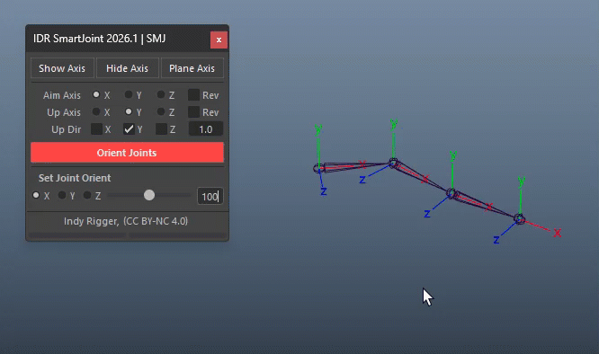
</p>

**Created nodes:**

- **`_targetAim`** — drag to define direction
- **`_aimJNT`** — proxy joint showing orientation preview (real joint hidden)
- **`_aimLOC`** — hidden from Outliner/Viewport

> <small>💡 **Aim active:** Press `Orient to Target Aim` to apply; `Clear Locator Aim` to cancel and delete locators.</small>

**Guidelines:** Ensure your **Aim Axis** and **Up Axis** are correctly defined before proceeding.

- **Aim Axis:** The axis pointing toward the next joint (forward). Typically set to **X (Red)**.
- **Up Axis:** The axis pointing upward to define the orientation. Typically set to **Y (Green)**.

<br>

## Orient Copy

Copies orientation from one source joint to one or more target joints.

1. Select the Source joint first
2. Shift+click all Target joints
3. RMB Orient Joints → Orient Copy
4. Press **[Orient Copy]**

<p align="center">
  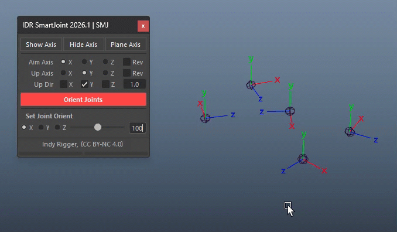
</p>

> <small>💡 **At least 2 joints required:** 1 source + 1 or more targets.</small>

<br>

## Straighten Chain

Redistributes joints along a straight line from root to end, then re-orients. Requires at least 3 joints.

1. Select 3+ joints (or a root joint with children)
2. RMB Orient Joints → Straighten Chain
3. Press **[Straighten Chain]**

<p align="center">
  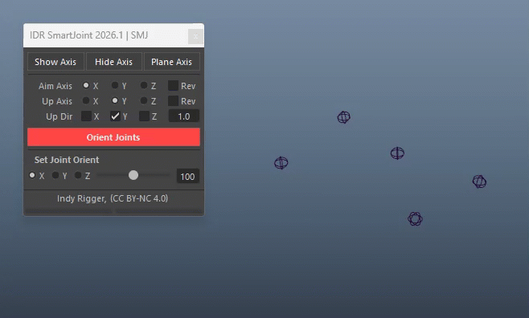
</p>

<br>

## Orient None

Freezes rotation and zeros jointOrient (makeIdentity + setAttr = 0).

1. Select joints
2. RMB Orient Joints → None
3. Press **[Joint None]**

<p align="center">
  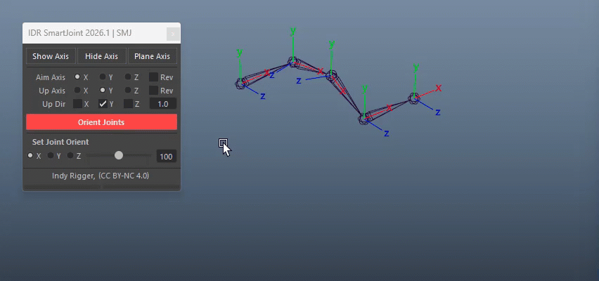
</p>

<br>

## Set Joint Orient

Adjusts jointOrient of selected joints in realtime using a slider.

| Control | Behavior |
| :--- | :--- |
| **Radio X/Y/Z** | Select which jointOrient axis to adjust |
| **Slider** | Drag to adjust jointOrient in realtime; covers −Max to +Max degrees |
| **Ctrl + Arrow ←/→** | Fine-adjust by 0.001° per step |
| **Max Text Box** | Set max degree range (default 100); MMB drag or Enter to change |

<p align="center">
  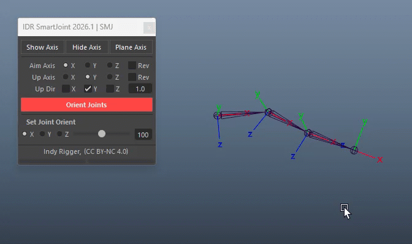
</p>

> <small>💡 RMB → Reset → resets Max to 10 and Slider to 0.</small>

**Set Joint Orient** and **Orient to Target Aim** share similar results but differ in workflow. **Orient to Target Aim** utilizes a locator for visual axis correction, while **Set Joint Orient** uses a UI-based approach for high-precision adjustments, making it ideal for fine-tuning axes with minute or decimal values.

<br>

## Show / Hide Local Axis

- **Show Axis** — displays local rotation axes on selected joints
- **Hide Axis** — hides local rotation axes

<p align="center">
  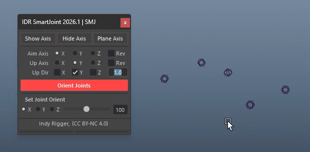
</p>

<br>

## Plane Axis Visualizer

Creates 3 colored plane meshes (XY/YZ/XZ) per joint to visualize local axes clearly.

1. Select Joints
2. Press **[Plane Axis]**

Planes are grouped under a parent constraint to the joint and follow it automatically.

<p align="center">
  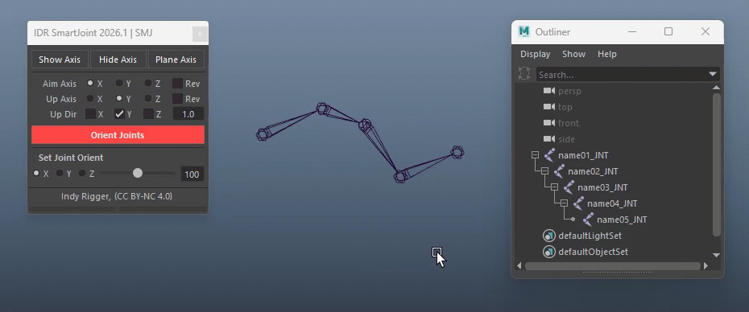
</p>

> <small>💡 RMB → Delete All (n) → deletes all plane axis groups in the scene (count shown).</small>

<br>
<br>

## Window Right-Click Menu

Right-click on any empty area in the window (avoiding buttons, sliders, or checkboxes) to open the Window Menu. As a frequently used tool, this design ensures quick access from anywhere within the UI.

| Menu Item | Behavior |
| :--- | :--- |
| **★ Select Joint Hierarchy** | Selects all joints in the hierarchy below the selection (disabled in Locator mode) |
| **★ Parent Hierarchy** | Parents joints in selection order: sel[0] ← sel[1] ← sel[2] ← ... |
| **★ Unparent** | Unparents selected joints to world |

<p align="center">
  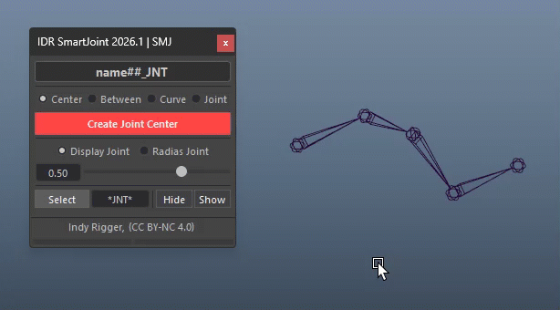
</p>

<br>
<br>

---

# **🔴 Troubleshooting**

- **Create does nothing** — Wrong selection → Select curve (Curve mode) or joint with child (Joint mode)
- **Joint at origin** — No selection → Select object or leave empty intentionally
- **Wrong rotation** — Component selected → Use transform only
- **Bias not working** — New/deleted joints → Use immediately after creation
- **Orient flips** — Up = Aim → Use different axes or enable *Rev Up*
- **Orient no effect** — Locked/connected → Remove connections
- **"Aim and Up same!"** — Same axis → Set different Aim/Up (e.g. X / Y)
- **Select by Suffix fails** — Pattern mismatch → Use `JNT*` or include namespace
- **Target Aim not rotating** — Using proxy → Check `_aimJNT`, then Apply
- **Delete All disabled** — No plane axis → Create first
- **Undo needs multiple steps** — Maya selection stack → Normal behavior
- **Orient disabled** — Locator mode → Switch back to Joint mode

**Quick Fix Checklist:**
Select objects first → Check joint/locator mode → Verify Aim & Up Axis (Page 2) → Confirm orient method → Check Script Editor for errors → Restart Maya if needed

<br>

# **🔴 Terminology**

- **Token** — Placeholder used in Name Pattern (e.g., `##`)
- **Joint** — Skeleton node for rigging
- **Locator** — Visual helper (not rendered)
- **Bounding Box (Bbox)** — Object bounds; center used for joint placement
- **Transform Node** — Node with translate/rotate/scale (mesh, joint, locator)
- **Component** — Sub-elements (vertex, edge, face, CV)
- **Pivot** — Object's local origin point
- **jointOrient** — Joint axis orientation (separate from Rotate)
- **Aim Axis** — Axis pointing to child joint
- **Up Axis** — Defines joint "up" direction
- **World Up Vector** — Global up reference for orientation
- **Spacing Bias** — Controls joint distribution density
- **Tangent** — Curve direction at a point
- **Normal** — Perpendicular direction from a surface
- **Closest Point** — Nearest point on surface
- **drawStyle** — Joint visibility (0 = visible, 2 = hidden)
- **parentConstraint** — Follows position + rotation of target
- **Chain Mode** — Joint chain with hierarchy
- **Free Mode** — Joints without hierarchy
- **Proxy Joint (`_aimJNT`)** — Temporary joint for aim preview
- **Wildcard** — Special characters (`*`, `?`) used as placeholders to match one or more characters for flexible search and selection

| Symbol | Description | Example | Result |
| :--- | :--- | :--- | :--- |
| `*` | Matches any number of characters | `L_*_Jnt` | L_Arm_Jnt, L_Leg_Jnt |
| `?` | Matches exactly one character | `Char_??` | Char_01, Char_A1 |

<br>

## Get the Tools
Visit the official store for advanced scripts and premium rigging assets.

[](https://indyrigger.gumroad.com/)

<br>

## Support This Project
If you find these tools helpful, consider supporting further development.

[](https://buymeacoffee.com/indyrigger)

<br>

## Connect & Contact
Follow for the latest updates, tutorials, and more rigging content.

[](https://www.facebook.com/indyrigger) [](https://www.youtube.com/indyrigger) [](mailto:rigger.indy@gmail.com)

<br>
<br>

🔴 เครื่องมือตัวนี้ผมตั้งใจทำและปล่อยให้ โหลดไปใช้กันได้ฟรีๆ ครับ เพราะอยากซัพพอร์ตน้องๆ นักเรียน หรือ Rigger มือใหม่ที่กำลังเริ่มหัดริก แต่อาจจะยังไม่มีงบซื้อเครื่องมือแพงๆ ผมอยากให้ทุกคนมีของดีไว้ใช้ฝึกฝนและอัปสกิลตัวเองกันให้เต็มที่

หวังว่า IDR Tools จะช่วยให้เส้นทางสาย Rigger ของทุกคนไปได้ไกลขึ้นนะครับ... วันไหนที่เก่งแล้ว ประสบความสำเร็จแล้ว จะกลับมาช่วยพัฒนา หรือสนับสนุนโปรเจกต์นี้ในรูปแบบไหน ผมก็ยินดีและขอบคุณมากๆ ครับ

…

🔴 I created this tool and made it freely available for download because I want to support students and beginner riggers who are just starting out but may not have the budget for expensive tools. I hope everyone can have access to good resources to practice and fully develop their skills.

I truly hope that IDR Tools can help you go further on your journey as a rigger. And one day, when you've grown and found success, if you choose to come back and contribute to the development or support this project in any way, I would deeply appreciate it.

<br>

<p align="center">
© 2026 Indy Rigger • Some rights reserved.
</p>