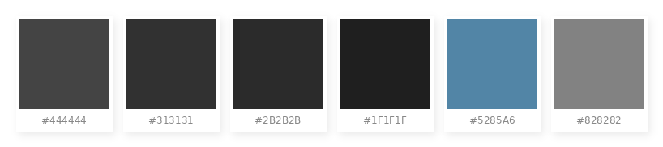
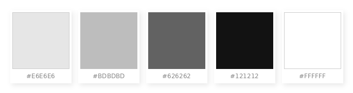
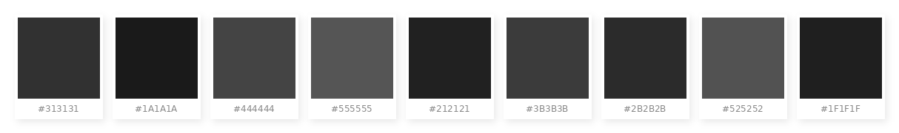

# Maya UI Color Palette
    

 

A reference palette of hex color values observed from the Maya 2022+ dark UI — sampled directly from the interface for use in custom Qt tools, PySide2/PySide6 stylesheets, and shader/viewport development. Values are grouped by functional role.

> <small>⚠️ These values were sampled independently from the Maya UI. They are not official Autodesk specifications and may vary slightly between Maya versions, OS, or monitor calibration.</small>

 

---

# 🎨 UI Core

  

The foundational background and accent colors that make up the Maya viewport and panel system.

| UI Component | Hex | Usage |
| :--- | :--- | :--- |
| **Background (Viewport)** | `#444444` | Mid-gray gradient background inside the Viewport |
| **Main Background** | `#313131` | Primary background color for windows and panels |
| **Secondary Background** | `#2B2B2B` | Darker background layer — used in areas like the Outliner |
| **Border / Darker Area** | `#1F1F1F` | Window borders and depth-emphasis areas |
| **Accent / Selection** | `#5285A6` | Muted blue used for selections and highlights |
| **Subtle Text** | `#828282` | Gray text for secondary or low-emphasis labels |

 
 

---

# 🔤 Text & Icon Colors

  

Text colors used across menus, Outliner labels, Channel Box, and Shelf icons.

| UI Component | Hex | Usage |
| :--- | :--- | :--- |
| **Active Text / Label** | `#E6E6E6` | Bright white text — active menu items and primary headings |
| **Standard Text** | `#BDBDBD` | Default color for object names in the Outliner and general menus |
| **Disabled / Dimmed** | `#626262` | Dark gray — used for unavailable menu items or unselected states |
| **Numeric Input** | `#121212` | Near-black background for numeric input fields (Channel Box) |
| **Shelf Icon Label** | `#FFFFFF` | White text below Shelf icons (typically rendered with a soft drop shadow) |

 
 

---

# 🪟 Qt Widget Style Palette

  

Colors observed in Maya's Qt widget layer — applicable to `QPalette` roles and `.qss` stylesheets when building tools that visually match the Maya UI.

| Widget Role | Hex | Usage |
| :--- | :--- | :--- |
| **Window** | `#313131` | Primary background for top-bar menus and windows |
| **Base** | `#1A1A1A` | Background for input fields (`QLineEdit`, `QTextEdit`) |
| **Button** | `#444444` | Default unpressed button color |
| **Button:Hover** | `#555555` | Button color on mouse-over (approximately 10–15% brighter) |
| **Button:Pressed** | `#212121` | Button color while being clicked (appears sunken) |
| **Header** | `#3B3B3B` | Header area of `TreeView` or `TableView` widgets |
| **Scrollbar** | `#2B2B2B` | Scrollbar track (rail) |
| **Scrollbar Handle** | `#525252` | Draggable scrollbar thumb |
| **Tooltip** | `#1F1F1F` | Tooltip background — dark enough to float above the UI |

 
 

---

# 🔴 Terminology

- **QPalette** — Qt's system for assigning colors to widget roles (Window, Base, Button, Text, etc.) across the entire application
- **QSS (Qt Style Sheet)** — CSS-like syntax used to override individual widget appearance in PySide2/PySide6
- **Viewport Background** — The 3D panel background rendered by Maya's hardware renderer, separate from the Qt UI layer
- **Accent / Selection** — The blue-gray highlight (`#5285A6`) applied to selected items in lists, trees, and menus
- **Axis Colors** — Fixed RGB assignments for the X, Y, Z transform axes — used in Manipulators, Channel Box, and viewport overlays
- **Shelf Icon Label** — The small text rendered below each shelf button icon; typically white with a soft drop shadow
- **Channel Box** — Maya's right-panel numeric input area; uses near-black (`#121212`) backgrounds for input fields
- **Disabled State** — UI elements that exist but cannot be interacted with; rendered in `#626262` to indicate inactivity
- **Scrollbar Handle** — The draggable thumb inside a scrollbar track; lighter than the track itself (`#525252` vs `#2B2B2B`)

 
 

---

## Get the Tools
Visit the official store for advanced scripts and premium rigging assets.

 

## Support This Project
If you find these tools helpful, consider supporting further development.

 

## Connect & Contact
Follow for the latest updates, tutorials, and more rigging content.

  

 

© 2026 Indy Rigger • Some rights reserved.

