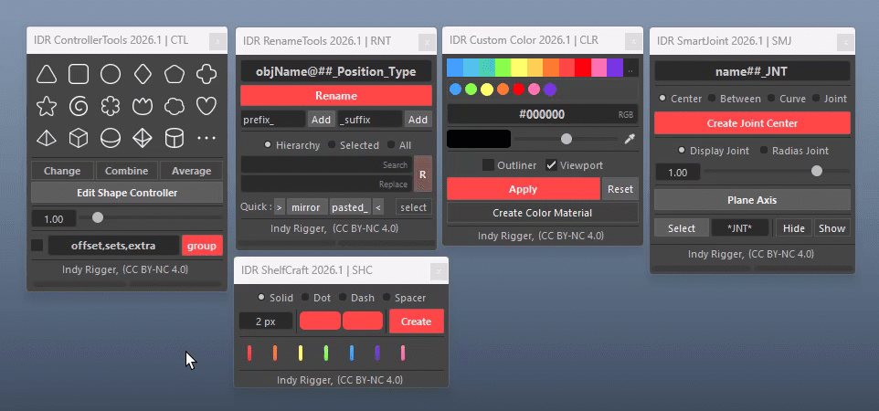

# IndyRigger Tools Documentation

     

Documentation for installation and usage of IndyRigger Maya tools.  
See the sections below for details.

 

## Tools Documentation

[📄 IDR ControllerTools v2026.1](./IDR-ControllerTools/CTL-docs.md)  
[📄 IDR RenameTools v2026.1](./IDR-RenameTools/RNT-docs.md)  
[📄 IDR CustomColor v2026.1](./IDR-CustomColor/CLR-docs.md)  
[📄 IDR SmartJoint v2026.1](./IDR-SmartJoint/SMJ-docs.md) 

[📄 Facial Blendshape Reference ☠️](./Facial-Blendshape-Reference/FBR-docs.md)  

 
 

## Get the Tools
Visit the official store for advanced scripts and premium rigging assets.

 

## Support This Project
If you find these tools helpful, consider supporting further development.

 

## Connect & Contact
Follow for the latest updates, tutorials, and more rigging content.

  

 
 

© 2026 Indy Rigger • Some rights reserved.

