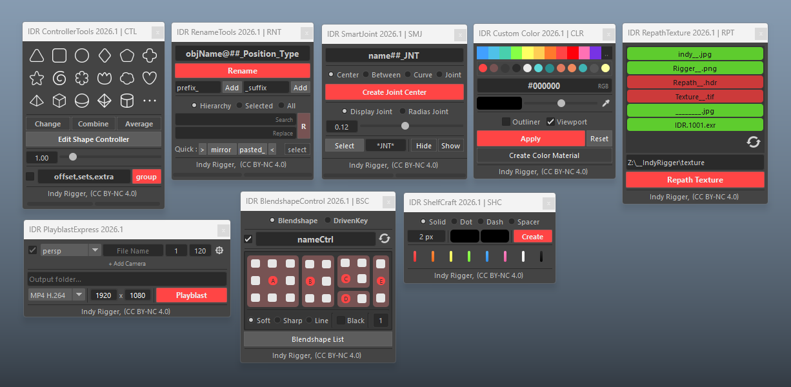

# IndyRigger Tools

     

This repository hosts a powerful toolkit for Autodesk Maya, along with its installation guides, usage documentation, and technical knowledge base.

 

## Tools Documentation

This repository hosts the installation, usage documentation, and technical knowledge base for the IndyRigger Maya toolset.  

👉 **[Installation Guide](./Tools-Docs/Install-Tools.md)**

[📄 ControllerTools v2026.1](./Tools-Docs/IDR-ControllerTools/CTL-docs.md)  
[📄 RenameTools v2026.1](./Tools-Docs/IDR-RenameTools/RNT-docs.md)  
[📄 CustomColor v2026.1](./Tools-Docs/IDR-CustomColor/CLR-docs.md)  
[📄 SmartJoint v2026.1](./Tools-Docs/IDR-SmartJoint/SMJ-docs.md)  
[📄 RepathTexture v2026.1](./Tools-Docs/IDR-RepathTexture/RPT-docs.md)  
[📄 ShelfCraft v2026.1](./Tools-Docs/IDR-ShelfCraft/SHC-docs.md)  
[📄 PlayblastExpress v2026.1](./Tools-Docs/IDR-PlayblastExpress/PBX-docs.md)  
[📄 BlendshapeControl v2026.1](./Tools-Docs/IDR-BlendshapeControl/BSC-docs.md)  
[📄 ShapeZone v2026.1](./Tools-Docs/IDR-ShapeZone/SZN-docs.md)  

 

## Knowledge
Useful tips, technical workflows, and fixes for common problems.  

[📖 Facial Blendshape Reference ☠️](./Knowledge/Facial-Blendshape-Reference/FBR-docs.md)  
[📖 Maya UI Color Palette](./Knowledge/Maya-UI-Color-Palette/Maya-UI-Color-Palette.md)  

 

---

## Get the Tools
Visit the official store for advanced scripts and premium rigging assets.

 

## Support This Project
If you find these tools helpful, consider supporting further development.

 

## Connect & Contact
Follow for the latest updates, tutorials, and more rigging content.

  

 
 

© 2026 Indy Rigger • Some rights reserved.

