# IDR PlayblastExpress v2026.1
     

 

  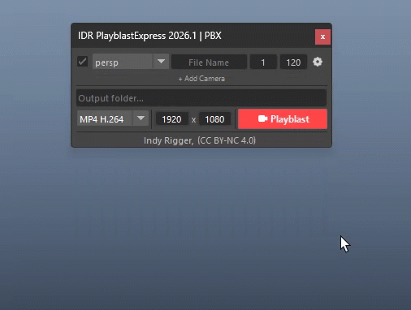

A powerful toolkit for creating professional playblasts and viewport snapshots directly from Maya. Queue multiple cameras, choose your format and resolution, and render all playblasts in one click. Includes built-in MP4 and MOV export support — no extra QuickTime installation needed.

 

## Installation Guide

👉 **[Install Tools](../Install-Tools.md)**

 

# Quick Walkthrough

## 🎬 Playblast Mode

1. Open **IDR PlayblastExpress** from the IDR shelf or the Script Editor.
2. Set your **Output Path** by right-clicking the path field and choosing **Browse…**
3. Type your **File Name** (no extension needed).
4. Choose a **Format** — MP4 H.264, MOV H.264, MOV PNG, AVI, or an image sequence.
5. Set your **Resolution** — right-click either the Width or Height field for presets.
6. Set the **Frame Range** (Start / End) in the Camera Row, or use the Gear menu → **Timeline Range**.
7. Check that the correct **Camera** is selected in the Camera Queue.
8. Click **Playblast** to render. The output file (or folder for image sequences) opens automatically when done.

  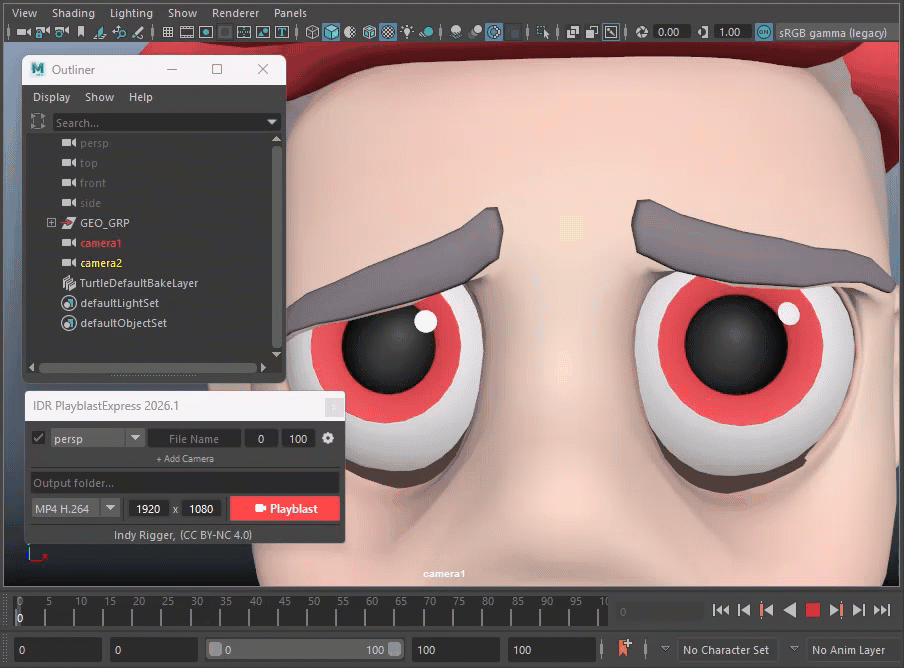

 

## 📷 Snapshot Mode

1. Open **IDR PlayblastExpress** from the IDR shelf or the Script Editor.
2. Set your **Output Path** by right-clicking the path field and choosing **Browse…**
3. Right-click the **Playblast** button and select **Snapshot** to switch modes.
4. Choose an image **Format** — img PNG, img EXR, or img JPEG.
5. Set your **Resolution** — right-click either the Width or Height field for presets.
6. Scrub the **Timeline** to the frame you want — the Start frame updates live automatically.
7. Click **Snapshot** to capture. The image file opens automatically when done.

  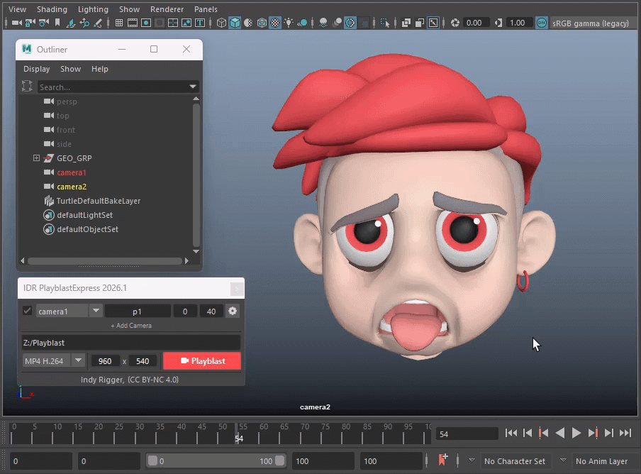

 
 

# UI Walkthrough
## Camera Queue

The Camera Queue is the core of PlayblastExpress — a scrollable list of camera rows, each representing one playblast job.

  

## Camera Row Structure

Each row contains:

| Element | Description |
| :--- | :--- |
| **Checkbox** | Enable or disable this row. Disabled rows are faded (35% opacity) and skipped during blast. |
| **Camera Combo** | Select the camera. Scene cameras appear under **"Scene Cameras"**, Maya defaults under **"Default Cameras"**. |
| **File Name** | Per-row output filename. Overrides the global filename at the top. Leave blank in Snapshot mode to auto-generate `<cam>.<frame>`.|
| **Start Frame** | Start of the frame range for this row. |
| **End Frame** | End of the frame range. Disabled (and mirrors Start) in Snapshot mode. |
| **Gear Button (⚙)** | Per-row options menu — see Gear Menu below. |

> <small>💡 At least one row must always be enabled. When only one row exists, its checkbox is locked ON automatically.</small>

 
 

### Gear Button Menu (Per Row)

  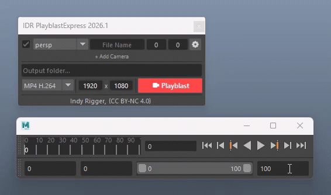

| Action | Description |
| :--- | :--- |
| **Timeline Selection** | Sets Start/End from the highlighted range on the Maya timeline slider. Falls back to full range if no selection exists. |
| **Timeline Range** | Sets Start/End from Maya's full playback range (`playbackOptions min/max`). |
| **Remove Camera** | Removes this row. Disabled when this is the only row. |
| **Duplicate Row** | Creates an exact copy of this row, inserted immediately below. |
| **Look Through** | Switches the active viewport to look through this row's camera. |

 
 

## Add Camera Button

  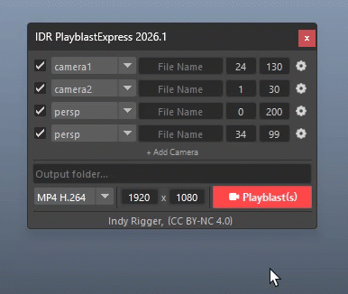

| Interaction | Action |
| :--- | :--- |
| **Left-click** | **Smart Add** — if cameras are selected in the Maya scene, those cameras are added as rows. If nothing is selected, the active viewport camera is added. |
| **RMB → Refresh Camera** | Rebuilds the camera list in every combo from the current scene. — see Refresh Camera Menu below.
| **RMB → Restore** | Loads the last auto-saved camera queue session. |
| **RMB → Save…** | Save the current queue as a named `.json` preset. |
| **RMB → Load… (submenu)** | Load a previously saved queue preset by name. |
| **RMB → Load… → Browse…** | Open a file picker to load any `.json` camera preset from disk. |
| **RMB → Remove All** | Removes all rows except the first. |

> <small>💡 The queue is **auto-saved** every time it changes. Use **Restore** after reopening the tool to pick up exactly where you left off.</small>

 
 

### Refresh Camera Menu

Right-click the **Add Camera** button and select **Refresh Camera** to rebuild the camera list across all Camera Rows from the current Maya scene.

  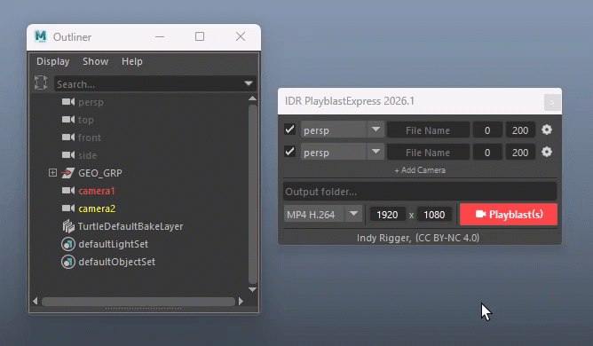

| Behaviour | Detail |
| :--- | :--- |
| **Preserves row selection** | Each row keeps its previously selected camera if it still exists in the scene after refresh |
| **Grouped on refresh** | The rebuilt list is always grouped — Scene Cameras on top, Default Cameras (persp / top / front / side) below |
| **No rows removed** | Refresh only updates the combo contents — it never adds, removes, or reorders Camera Rows |

> <small>💡 Use this after adding, renaming, or deleting cameras mid-session without reopening the tool.</small>

 
 

## Output Path

The top field sets the folder where all output files are saved.

  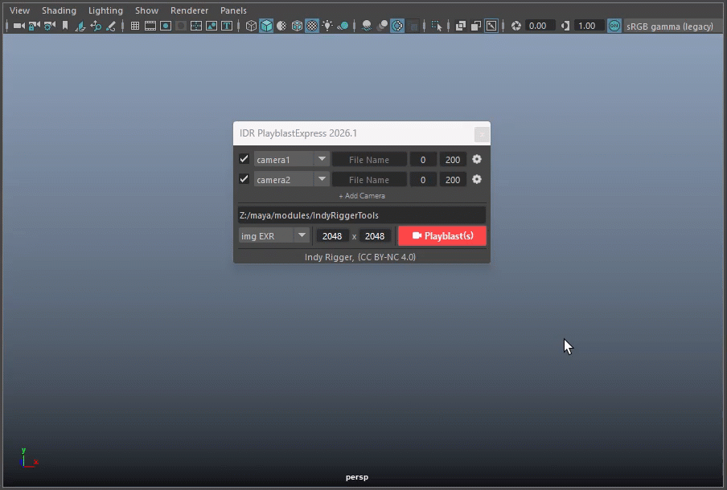

| Interaction | Action |
| :--- | :--- |
| **Type directly** | Paste or type a folder path manually |
| **RMB → Browse…** | Open a folder picker dialog |
| **RMB → Open Folder** | Open the current path in the OS file explorer |
| **RMB → Save Preset** | Save the current path + format + resolution as a named `.json` preset |
| **RMB → Load Preset** | Load a previously saved path preset (restores path, format, and resolution together) |
| **RMB → Load Preset → Browse Preset…** | Open the preset folder in the OS file explorer |

> <small>💡 When using an image sequence format (**img PNG**, **img EXR**, **img JPEG**), a subfolder is created automatically inside the output path for each camera row, named after the filename. All frames for that camera are saved inside it, keeping sequences organized and separate from one another.</small>

 
 

### Output Path Preset — Save & Load

Different projects often require different output settings. Output Path Presets let you save the output path, format, and resolution as a single preset for quick switching between setups.

Right-click the **Output Path** field to save and load path presets.

  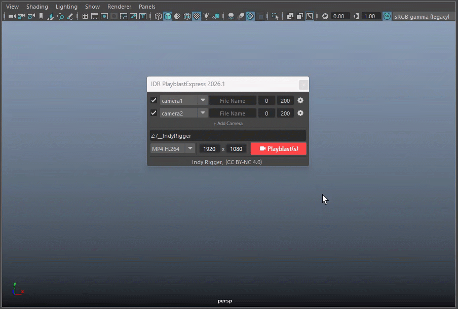

| Option | Description |
| :--- | :--- |
| **Save Preset** | Save the current Output Path + Format + Resolution together as a `.json` file |
| **Load Preset (submenu)** | Load a previously saved preset by name — restores all three values at once |
| **Load Preset → Browse Preset…** | Open the preset folder in the OS file explorer |

> <small>💡 A Path Preset saves **Output Path + Format + Resolution** as a trio — ideal for switching between delivery specs such as "Client MP4 1080p" and "Internal PNG 720p".</small>

 
 

## Format
 
A grouped dropdown listing all output formats available on your system.
 

  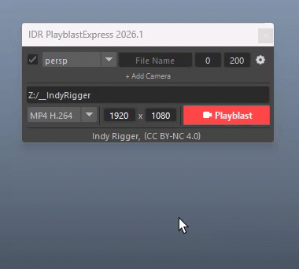

| Format | Description |
| :--- | :--- |
| **MP4 H.264** | H.264 video encoded via ffmpeg. Best for review and delivery. |
| **MOV H.264** | Same H.264 encoding but wrapped in a `.mov` container. |
| **MOV PNG** | Lossless PNG frames inside a `.mov` container. Maximum quality with accurate colors. |
| **AVI** | Raw AVI directly from Maya. No ffmpeg needed. |
| **img PNG** | PNG image sequence. |
| **img EXR** | OpenEXR image sequence. |
| **img JPEG** | JPEG image sequence. |
 
> <small>💡 In **Snapshot mode**, video formats are greyed out automatically and the selection defaults to **img PNG**.</small>
 

 
 
 
### Which format should I use?
 
| Format | Quality | Color Accuracy | File Size | Best For |
| :--- | :---: | :---: | :---: | :--- |
| **MP4 H.264** | 7/10 | 6/10 | Small | Daily review, sharing with team, client preview |
| **MOV H.264** | 7/10 | 6/10 | Small | Same as MP4 but for Mac / QuickTime workflows |
| **MOV PNG** | 10/10 | 10/10 | Large | Color checks, shading review, editing pipeline |
| **AVI** | 8/10 | 8/10 | Large | Quick local blast without ffmpeg |
| **img PNG** | 10/10 | 10/10 | Medium | Frame-accurate review, compositing, retouching |
| **img EXR** | 10/10 | 10/10 | Large | VFX pipeline, HDR, multi-pass compositing |
| **img JPEG** | 5/10 | 5/10 | Small | Rough thumbnails, fast previews, web sharing |
 
> <small>💡 **Quality** and **Color Accuracy** are rated out of 10 (higher is better).   
> 💡 **File Size** shows relative output size: Small = easier sharing, Large = better quality or compatibility.</small>
 
  
 
**MP4 H.264 / MOV H.264** — Default choice for most playblasts. Uses compression, causing slight color and detail loss, but creates small files that work almost everywhere. Ideal for animation reviews and team sharing.

**MOV PNG** — Lossless output with no color shift or quality loss. Larger file size, ideal for accurate shading and lighting review. **May not work in standard media players;** use editing or compositing software, or QuickTime Player for playback.

**AVI** — Maya’s built-in output without ffmpeg. Useful as a backup option, though files are larger and compatibility is more limited.

**img PNG** — Lossless image sequence with separate frames. Great for frame inspection, still images, and compositing workflows.

**img EXR** — High dynamic range format for VFX pipelines, preserving more color and lighting information.

**img JPEG** — Smallest file size with lower image quality. Suitable for quick previews only.

 
 

## Resolution

Two linked fields — Width and Height — that control the playblast pixel dimensions.

  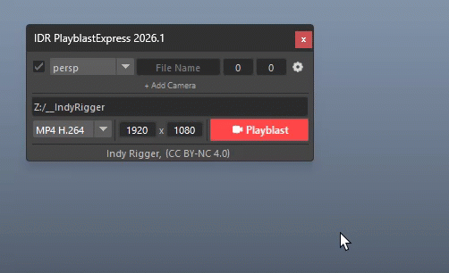

| Interaction | Action |
| :--- | :--- |
| **Left-click → type** | Enter any positive integer and press Enter |
| **RMB (on either field)** | Open the full preset menu — grouped by category |
| **RMB → Swap** | Swap Width and Height values (useful for portrait/vertical formats) |

**Resolution preset categories:**

| Category | Examples |
| :--- | :--- |
| **Video** | qHD (960×540) · HD (1280×720) · Full HD (1920×1080) · 2K · 4K · 8K |
| **Square 1:1** | 1K · 2K · 4K square |
| **Social Media** | Square 1:1 · Reels/Vertical · Portrait 4:5 · Landscape 16:9 |
| **Paper** | A2 · A3 · A4 · A5 (at 300 dpi) |
| **Photo** | 10×8 in · 7×5 in · 6×4 in · 3×2 in |

> <small>💡 Selecting any resolution preset from the menu **also updates Maya's Render Settings** automatically — no manual sync needed.</small>

 
 

## Playblast / Snapshot Button

The main execute button — its label and icon update dynamically based on mode and the number of enabled camera rows.

  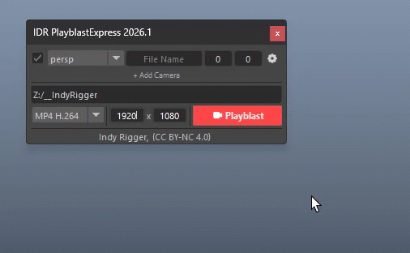

| State | Label |
| :--- | :--- |
| Playblast mode, 1 camera enabled | **Playblast** |
| Playblast mode, 2+ cameras enabled | **Playblast(s)** |
| Snapshot mode, 1 camera enabled | **Snapshot** |
| Snapshot mode, 2+ cameras enabled | **Snapshot(s)** |
| No cameras enabled | Button is **disabled** |

| Interaction | Action |
| :--- | :--- |
| **Left-click** | Execute playblast or snapshot for all enabled rows |
| **RMB** | Open the Options menu |

 

### Options Menu (RMB on Playblast Button)

| Option | Description |
| :--- | :--- |
| **Playblast** | Switch to Playblast mode — renders a full frame range video or image sequence |
| **Snapshot** | Switch to Snapshot mode — captures a single frame per row |
| **View**  | Auto-open the output file (or folder) after a successful blast. On by default. |
| **Mesh Only** | Hide everything in the viewport except polygon meshes during the blast. Curves, joints, locators, lights, cameras, grid, and HUD are all suppressed. |
| **No Gate** | Apply "No Gate" to all cameras in the scene — disables Film Gate, Resolution Gate, Gate Mask, Safe Action, Safe Title, Field Chart, Film Origin, and Film Pivot on every camera shape. |

> <small>💡 **Mesh Only** and **No Gate** are applied non-destructively — viewport state is saved before the blast and restored immediately after.</small>

 
 

## Snapshot Mode

Snapshot mode captures a **single frame** instead of a frame range. It is activated via the RMB menu on the Playblast button.

  

| Behaviour | Detail |
| :--- | :--- |
| **Active viewport camera** | First row is automatically set to the active viewport camera on entering Snapshot mode |
| **Realtime frame tracking** | The Start frame field in rows matching the active viewport camera updates **live** (every 100 ms) as you scrub the timeline |
| **End frame disabled** | The End frame field is greyed out — snapshot always captures a single frame |
| **Format locked** | Video formats are greyed out; defaults to **img PNG** |
| **Auto filename** | If the row File Name is empty, output is named `<camera>.<frame>.<ext>` (e.g. `shotCam.f84.png`) |
| **Multi-cam snapshot** | Enable additional rows manually to snapshot multiple cameras at the same frame simultaneously |

 
 

# **🔴 Troubleshooting**

| Problem | Likely Cause | Solution |
| :--- | :--- | :--- |
| **MP4 / MOV formats not visible** | ffmpeg not found | Install ffmpeg and add it to system PATH, or place `ffmpeg.exe` in the tool's `bin/` folder |
| **"Select output path first"** | `txt_pathDir` is empty | RMB on the path field → **Browse…** and select a folder |
| **"Output path does not exist"** | Folder was deleted or path is wrong | Re-browse to a valid folder |
| **"No cameras enabled"** | All checkboxes are unchecked | Check at least one camera row |
| **"Start frame > End frame"** | Frame range is inverted in a row | Correct Start/End values or use Gear → **Timeline Range** |
| **"Invalid resolution"** | Width or Height field is 0 or blank | RMB on Width or Height and choose a preset, or enter a positive integer |
| **Playblast button disabled** | All rows unchecked or queue is empty | Enable at least one camera row |
| **Duplicate filename flash (red)** | Two rows share the same File Name | Give each row a unique filename |
| **Snapshot frame not updating** | `txt_start` has keyboard focus | Click elsewhere to release focus; realtime tracking resumes |
| **"No saved session found"** | Autosave file missing (first launch or deleted) | This is normal on first launch — add rows and they will autosave immediately |
| **Camera missing from combo** | Camera added to scene after tool opened | Click **Refresh Camera** or use RMB on Add Camera → **Refresh Camera** |
| **Output file not found after blast** | ffmpeg encode failed | Check the Maya Script Editor for ffmpeg error details |
| **"Cannot open folder / file"** | OS permission issue or path contains special characters | Verify the output folder is accessible and the path contains no unsupported characters |

 
 

# **🔴 Terminology**

| Term | Definition |
| :--- | :--- |
| **Playblast** | A Maya viewport render that captures animation as a video or image sequence directly from the 3D viewport (not a full render) |
| **Snapshot** | A single-frame capture of the viewport at the current timeslider position |
| **Camera Queue** | The list of Camera Row entries, each defining a camera, filename, and frame range for one blast job |
| **Camera Row** | A single entry in the Camera Queue representing one camera's blast settings |
| **Gear Menu** | The per-row options menu accessed by clicking the ⚙ icon at the right of each Camera Row |
| **Smart Add** | The left-click behaviour of the Add Camera button — adds scene-selected cameras or falls back to the active viewport camera |
| **Multi-cam Blast** | Running the queue with more than one enabled Camera Row — each row produces its own output file |
| **ffmpeg** | Open-source video encoding tool used by PlayblastExpress to produce MP4 H.264, MOV H.264, and MOV PNG outputs |
| **Mesh Only** | A playblast option that hides all non-polygon objects (curves, joints, locators, lights, cameras, grid, HUD) for a clean geometry view |
| **No Gate** | Disables all camera overlay guides (Film Gate, Resolution Gate, Safe Action, Safe Title, etc.) on every camera in the scene |
| **Autosave** | The automatic background save of the Camera Queue to `_autosave.json` triggered by any queue change |
| **Restore** | Loading the last autosaved Camera Queue session |
| **Timeline Selection** | The frame range highlighted (shift-dragged) on Maya's timeline slider |
| **Timeline Range** | Maya's full playback range as set in `Window → Settings → Preferences → Time Slider` or via `playbackOptions` |
| **Look Through** | Switching a viewport to render from a specific camera's point of view |
| **Image Sequence** | A series of numbered still images (PNG, EXR, or JPEG) used as an alternative to video output |

 
 

## Get the Tools
Visit the official store for advanced scripts and premium rigging assets.

 

## Support This Project
If you find these tools helpful, consider supporting further development.

 

## Connect & Contact
Follow for the latest updates, tutorials, and more rigging content.

  

 

© 2026 Indy Rigger • Some rights reserved.

