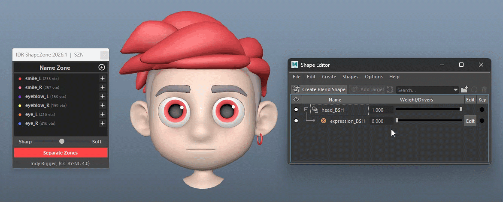
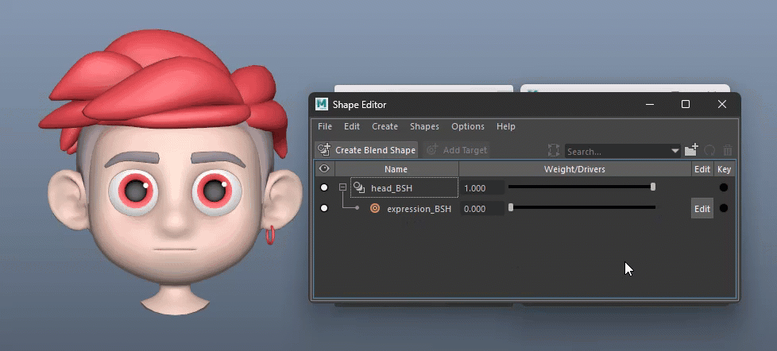
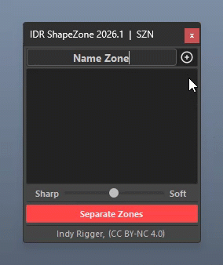
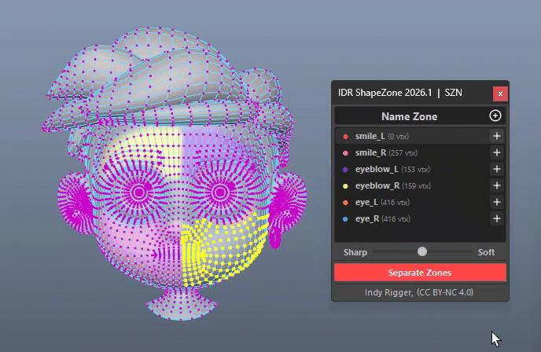
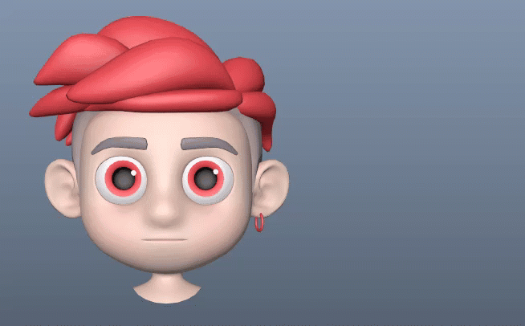
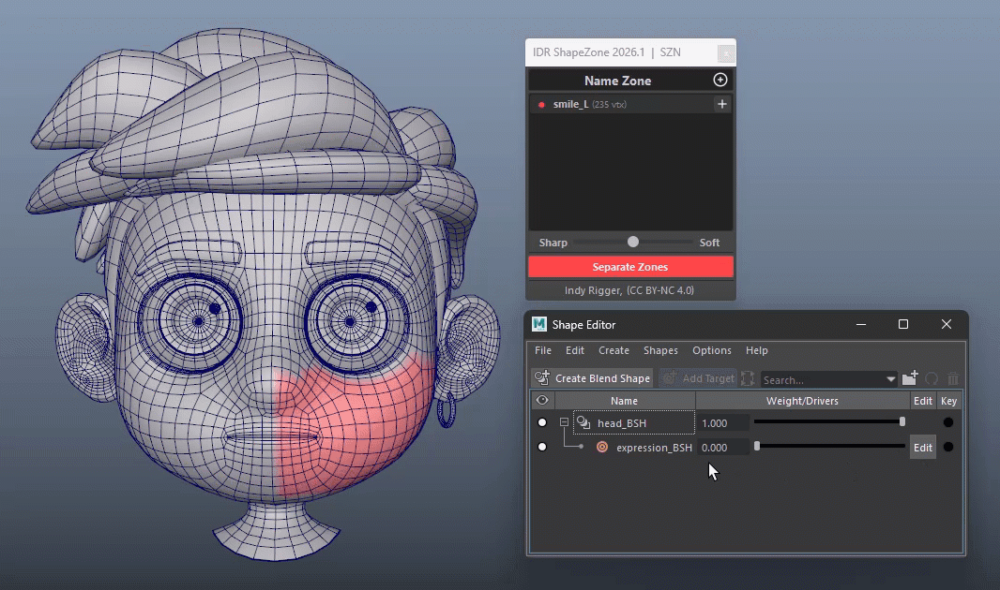
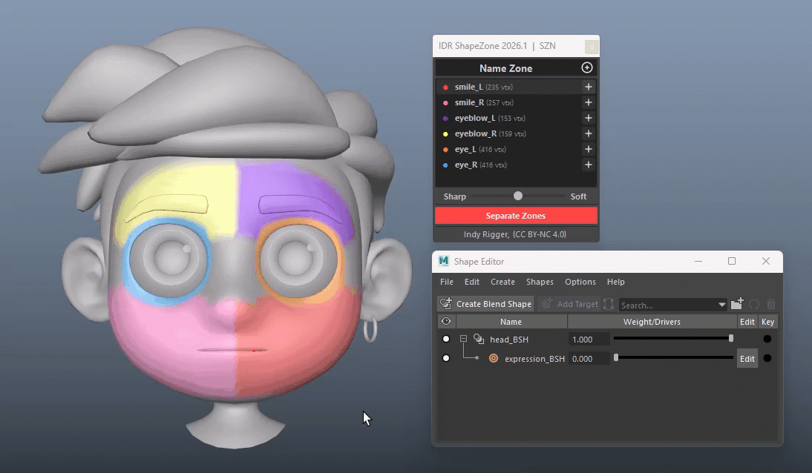
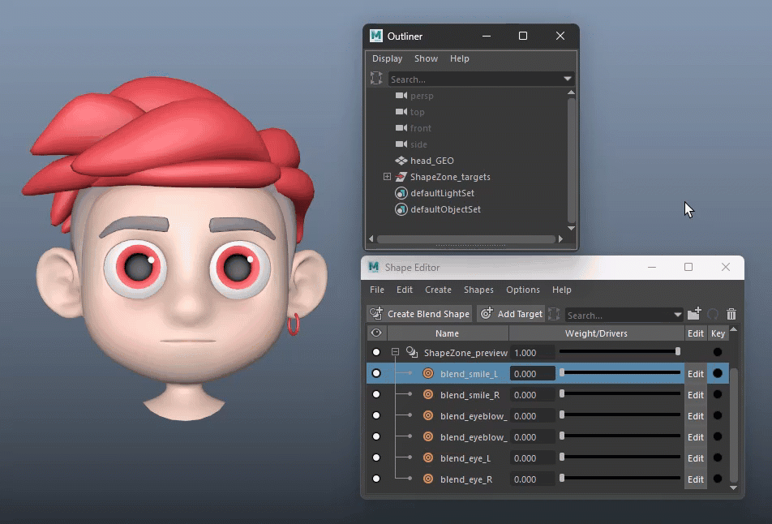
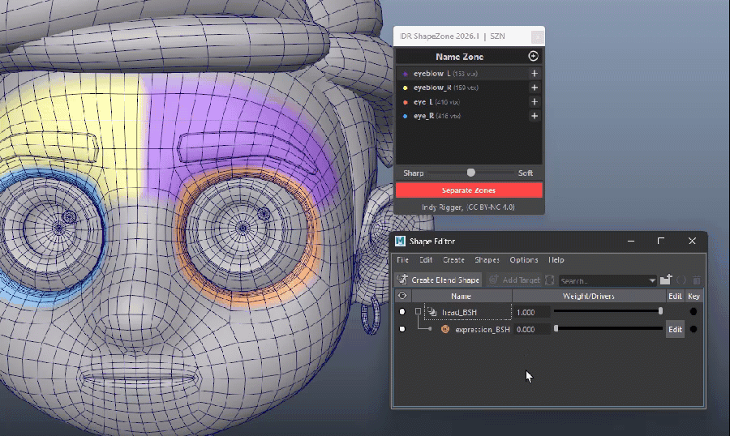
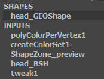

# IDR ShapeZone v2026.1
     

 

  

A powerful toolkit for splitting a single blendShape target into independent, region-based blendShapes — paint vertex zones directly in the viewport, let auto-falloff and weight-normalization handle clean boundaries, and generate ready-to-use split targets with a live preview blendShape in one click.

 

## Installation Guide

👉 **[Install Tools](../Install-Tools.md)**

 

# Quick Walkthrough

1. Select a mesh that already has a blendShape deformer with **one target dialed to 1.0**.
2. Open IDR ShapeZone — the mesh is auto-detected from your selection.
3. Type a zone name and click **+ Add Zone** (or press Enter).
4. Select vertices in the viewport, then click the **+** button on that zone's row.
5. Repeat for as many zones as you need.
6. Click **Separate Zones** — falloff, normalization, and output meshes are generated automatically, with a live preview blendShape added to your base mesh.
7. The **Outliner** contains a hidden **`ShapeZone_targets`** group with the generated blendShape targets for each zone, ready for use.

  

 
 

# UI Walkthrough

## Zone Name Field

Text input at the top of the window used to name a new zone before adding it.

  

| Interaction | Action |
| :--- | :--- |
| **Type name + Enter** | Same as clicking **+ Add Zone** |
| **Type name + click +Add Zone** | Creates a new zone entry in the list |
| Empty field | Blocked — warning "Enter a zone name." |
| Duplicate name | Blocked — warning "'Name' already exists." |

> <small>💡 **Save the scene first.** The tool creates its `-SZN.json` sidecar from the scene path. **Untitled** scenes cannot add zones.</small>

 
 

## Zone List

The middle scrollable panel lists every zone as a row:

  

| Interaction | Action |
| :--- | :--- |
| **Left-click +** | Assigns the current viewport selection to this zone (replaces its previous vertex set) |
| **Double-click zone name** | Selects that zone's vertices in the Maya viewport |
| **Right-click a zone** | Opens the context menu: **Rename, Clear, Delete, Show/Hide Color, Save, Load** |
| **Right-click empty space** | Opens the **Show/Hide Color, Save, and Load** menu |

> <small>💡 **Assign replaces, not adds.** Assigned vertices are automatically removed from any other zone.</small>
>

### Context Menu

| Item | Action |
| :--- | :--- |
| **Rename...** | Renames the zone (empty or duplicate names are rejected) |
| **Clear** | Removes all assigned vertices while keeping the zone |
| **Delete** | Removes the zone from the list |
| **Show / Hide Color** | Toggles viewport colors without changing zone data |
| **Save** | Exports the current zones to a selected `.json` file |
| **Load → Current File** | Shows the JSON sidecar paired with the current scene (read-only) |
| **Load → Reload JSON** | Reloads the current sidecar from disk |
| **Load → Load JSON...** | Loads zones from another `.json` file |

> <small>💡 Loading JSON (**Reload** or **Load JSON...**) replaces all current zones and asks for confirmation if zones already exist.</small>
> <small>💡 Every zone edit is automatically saved to the scene's JSON sidecar. Use **Save** only to export to a different file or location.</small>

 
 

## Show / Hide Zone Colors

Toggles the zone color overlay in the viewport only. Hide the colors temporarily to inspect the original mesh, topology, or shape more clearly, then show them again at any time.

The color overlay is automatically hidden when the tool is closed and restored when it is opened again.

  

 
 

## Smooth Slider

Horizontal slider controlling how far the automatic falloff calculation is pushed sharper or softer.

  

| Interaction | Action |
| :--- | :--- |
| **Left-click drag** | Adjusts the smooth offset from 0.00 (sharper boundary) to 1.00 (softer boundary); a floating value label follows the handle while dragging |
| **Release drag** | Value label disappears |
| **RMB** | Context menu → **Reset** — returns the slider to 0.50 (auto / no offset) |

> <small>💡 0.50 is the default "auto" position — the tool calculates falloff automatically per zone based on boundary edge count. Moving the slider only nudges that automatic value up or down; it does not replace the calculation.</small>

 
 

## Separate Zones

Runs the full split: falloff smoothing, weight normalization, and output mesh generation for every zone that has vertices assigned.

  

| Interaction | Action |
| :--- | :--- |
| **Left-click** | Generates one `blend_<zone name>` mesh per painted zone, builds/refreshes a `ShapeZone_preview` blendShape on the base mesh, and hides the output meshes in a locked, invisible `ShapeZone_targets` group |

> <small>💡 Exactly **one** blendShape target weight must be active (set to 1.0) the first time you snapshot. If none are active, the tool temporarily activates the first target for you; if more than one is active, it stops and asks you to isolate a single target.</small>

 
 

## Finishing up
After verifying the results with **`ShapeZone_preview`**, you can use the generated blendShape target meshes in **`ShapeZone_targets`** immediately. The **`ShapeZone_preview`** node can then be deleted from Maya's **Shape Editor**, as it is only used for preview and is no longer required.

  

 
 

# 🟢 Tips & Best Practices
- **Zone Selection Guide** — Include both the **Core Area** and the **Falloff Area**, not just the moving vertices. After **Separate Zones**:
  - **Creases** → Select more surrounding vertices.
  - **Affects neighboring zones** → Adjust the zone boundaries.
  - **Smooth result** → Your selection is correct. ✓

> <small>💡 The **Smooth Slider** softens the transition between zones, but it **cannot fix poor vertex selection**. A value of **0.5** works well for most cases. If creases remain even at **1.0**, improve the **vertex selection** instead of increasing the slider.</small>

  

- **Making edits after Separate Zones** — don't recreate the zone from scratch. Just add or remove vertices on the existing zone (via the row's **+** with an updated viewport selection), then click **Separate Zones** again to re-separate.
- **Reading the Construction History** — With the mesh selected, Maya's History typically contains `polyColorPerVertex1`,  `createColorSet1`, `ShapeZone_preview`, and your `Source BlendShape` node.

  - **`polyColorPerVertex1` / `createColorSet1`** — Displays zone colors only. These nodes are recreated when the tool opens and removed when it closes, so they're safe to ignore.
  - **`ShapeZone_preview`** — A preview blendShape combining all `blend_<zone name>` targets for live preview. It's rebuilt whenever you click **Separate Zones** and can be deleted after transferring the targets to your main blendShape.
  - **`Source BlendShape`** — The original source node read by ShapeZone. The tool never renames or deletes it.

  

- **Auto-Save** — Zone data is automatically saved to a -SZN.json sidecar file next to your scene whenever you add, edit, rename, clear, or delete a zone, and is automatically restored when you reopen the same scene.
  - **Save the scene first.** If the scene is **Untitled**, the tool cannot create the `-SZN.json` file and adding zones is disabled.
  - Using **Save As** creates a **new `-SZN.json`** for the new scene. The previous sidecar is not copied automatically.
  - The **Save** option (right-click menu) is only for **Export / Save As** of the JSON file. Auto-Save already handles normal saving automatically.

 
 

# 🔴 Troubleshooting

| Message / Issue | Solution |
|-----------------|----------|
| **"Enter a zone name."** | Enter a zone name before clicking **Add**. |
| **" 'Name' already exists."** | The zone name already exists. Use a different name or rename/delete the existing zone. |
| **"Select mesh with blendShape first."** | Select a mesh (or its shape) that has a blendShape before adding a zone. If needed, reopen the tool to refresh auto-detection. |
| **"Please save the Maya scene file first."** | Save the scene first. The tool cannot create its `-SZN.json` sidecar while the scene is **Untitled**. |
| **"Set only ONE blendShape target to 1.0"** | Before **Separate Zones**, set exactly one blendShape target to **1.0** and all others to **0.0**. |
| **"Snapshot failed — check mesh has blendShape."** | The selected mesh has no valid blendShape. Reselect the correct mesh and reopen the tool if necessary. |
| **"No vertices assigned to any zone."** | Assign vertices to at least one zone before running **Separate Zones**. |
| **"No components selected on `<mesh>`."** | Select vertices, edges, or faces on the correct mesh before clicking **+**. |
| **Generated `blend_<name>` meshes are missing** | They are intentionally hidden under the locked **ShapeZone_targets** group. Check the **Outliner**. |
| **Old output mesh still deforms the model** | Click **Separate Zones** again to rebuild the outputs and remove obsolete `blend_*` meshes. |
| **JSON changes aren't showing** | Use **Right-click → Load... → Reload JSON** to reload the sidecar after external edits. |
| **Zones don't appear after reopening** | Use **Right-click → Load... → Reload JSON** or **Load JSON...** to load the sidecar manually. |

 
 

# 🔴 Terminology

| Term | Description |
|------|-------------|
| **Zone** | A named group of vertices that becomes an independent split blendShape target. |
| **Source BlendShape** | The original blendShape node and target used as the source for ShapeZone. |
| **Snapshot** | Cached base pose, target pose, and mesh adjacency data used by **Separate Zones**. |
| **Auto Falloff** | Automatically calculates boundary smoothing based on the zone's boundary edges. |
| **Smooth Offset** | A **0.0–1.0** adjustment to the auto falloff. **0.5** is neutral (auto). |
| **Gray / Unpainted** | Vertices not assigned to any zone. |
| **Display Color Set** | Temporary viewport color set used to visualize zones; removed automatically when the tool closes. |
| **JSON Sidecar (`-SZN.json`)** | Companion file stored next to the Maya scene that contains all zone data. |
| **ShapeZone_preview** | Auto-generated preview blendShape for live visualization of all zone targets. |
| **ShapeZone_targets** | Hidden, visibility-locked group containing all generated `blend_<name>` meshes. |

 
 

## Get the Tools
Visit the official store for advanced scripts and premium rigging assets.

 

## Support This Project
If you find these tools helpful, consider supporting further development.

 

## Connect & Contact
Follow for the latest updates, tutorials, and more rigging content.

  

 

© 2026 Indy Rigger • Some rights reserved.

