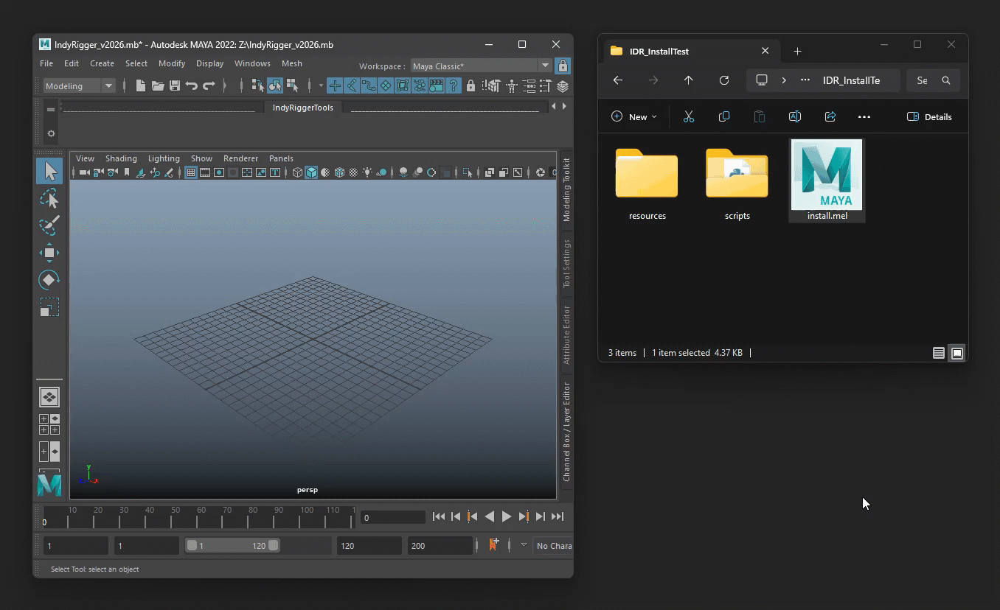

# **Technical Specifications**

| Maya Version : | 2022+ |
| :--- | :--- |
| **Language :** | Python <br> PySide2 (Maya 2022–2024) <br> PySide6 (Maya 2025+) |
| **OS :** | Windows · macOS · Linux |
| **License :** | [CC BY-NC 4.0 — Attribution-NonCommercial 4.0](https://creativecommons.org/licenses/by-nc/4.0/) <br> Personal use only / Shareable / No commercial use allowed |

# **Installation**

## **◽** Method 1: Drag & Drop (Recommended)

1. Unzip the package
2. Place the folder (e.g., *Documents/maya/scripts*)
3. Open Maya
4. Drag **install.mel** into the Viewport
5. Shelf button is created automatically



*Dragging install.mel into Maya Viewport and the tool button appearing on the Shelf.*

## ◽ Method 2: Manual Install

Windows · macOS · Linux

1. Copy folder to: *~/maya/scripts/IDR_ControllerTools_v2026.1*
2. Open Script Editor (Python) and run:

```python
import os
import sys

home_dir = os.path.expanduser("~")

paths = [
    os.path.join(home_dir, "Documents", "maya", "scripts", "IDR_ControllerTools_v2026.1", "scripts"),
    os.path.join(home_dir, "maya", "scripts", "IDR_ControllerTools_v2026.1", "scripts"),
]

for path in paths:
    if os.path.exists(path):
        sys.path.insert(0, path)
        break

import IDR_ControllerTools
IDR_ControllerTools.show()
```